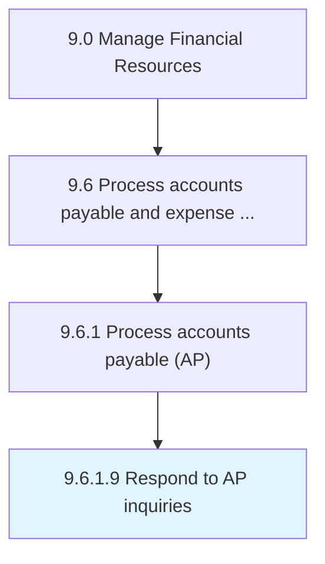

# Respond to AP inquiries

> Clarifying or address queries relating to the particulars of AP such as date, discounts, amount, and installments.

## Overview

Activity 9.6.1.9 is an activity within the Manage Financial Resources framework. 

Clarifying or address queries relating to the particulars of AP such as date, discounts, amount, and installments. Coordinate with concerned parties about the fulfillment of bills payable.

## Process Hierarchy



## Key Statistics

| Metric | Value |
|--------|-------|
| APQC Code | 10877 |
| Hierarchy ID | 9.6.1.9 |
| Level | Activity |
| Parent | [9.6.1](../) |
| Sub-Processes | 0 |


## GraphDL Semantic Structure

```
respond.ToAPInquiries
```

| Component | Value | Description |
|-----------|-------|-------------|
| Verb | `respond` | Primary action |
| Object | `to AP inquiries` | Direct object |


## Related Concepts

- APInquiries


---

*Source: APQC PCF 10877 (9.6.1.9) - APQC*
