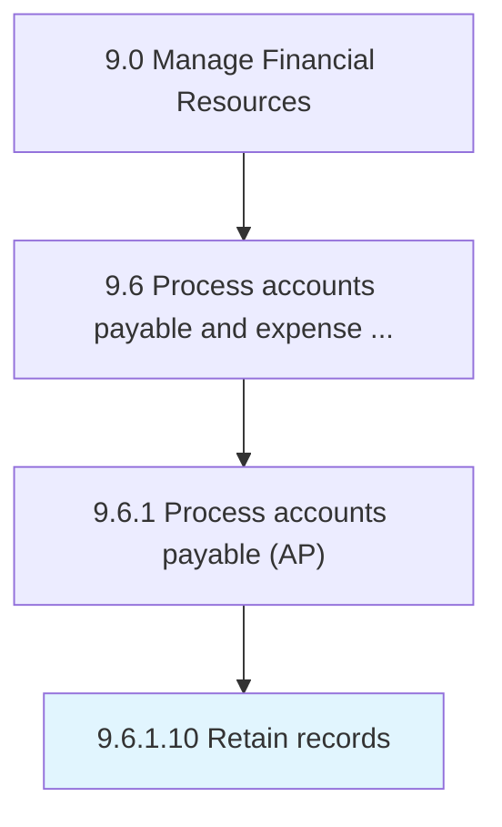

# Retain records

> Keeping bills of every transaction for future reference.

## Overview

Activity 9.6.1.10 is an activity within the Manage Financial Resources framework. 

Keeping bills of every transaction for future reference.

## Process Hierarchy



## Key Statistics

| Metric | Value |
|--------|-------|
| APQC Code | 10878 |
| Hierarchy ID | 9.6.1.10 |
| Level | Activity |
| Parent | [9.6.1](../) |
| Sub-Processes | 0 |


## GraphDL Semantic Structure

```
retain.Records
```

| Component | Value | Description |
|-----------|-------|-------------|
| Verb | `retain` | Primary action |
| Object | `records` | Direct object |


## Related Concepts

- [Records](/concepts/Records)


---

*Source: APQC PCF 10878 (9.6.1.10) - APQC*
