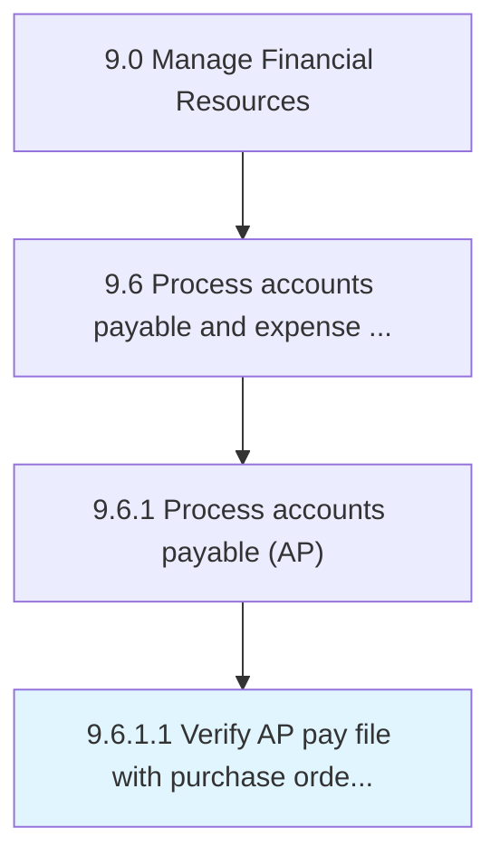

# Verify AP pay file with purchase order vendor master file

> Matching records of bills to be paid with accounts.

## Overview

Activity 9.6.1.1 is an activity within the Manage Financial Resources framework. 

Matching records of bills to be paid with accounts. Check accounts payable entries with vendor's account for every payment made.

## Process Hierarchy



## Key Statistics

| Metric | Value |
|--------|-------|
| APQC Code | 10869 |
| Hierarchy ID | 9.6.1.1 |
| Level | Activity |
| Parent | [9.6.1](../) |
| Sub-Processes | 0 |


## GraphDL Semantic Structure

```
verify.APPayFile.with.PurchaseOrderVendorMasterFile
```

| Component | Value | Description |
|-----------|-------|-------------|
| Verb | `verify` | Primary action |
| Object | `AP pay file` | Direct object |
| Preposition | `with` | Relationship |
| PrepObject | `purchase order vendor master file` | Indirect object |


## Related Concepts

- APPayFile
- PurchaseOrderVendorMasterFile


---

*Source: APQC PCF 10869 (9.6.1.1) - APQC*
