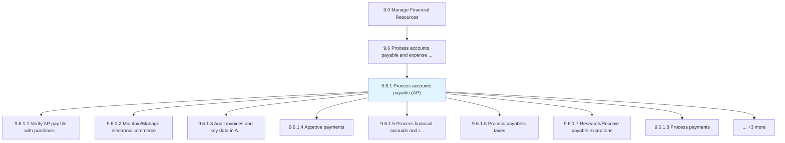
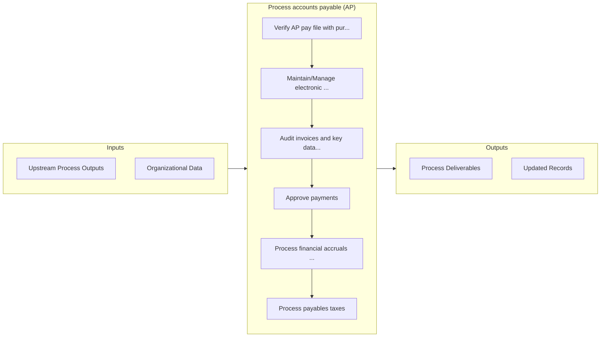

# Process accounts payable (AP)

> Processing payments of operating expenses and other supplier charges.

## Overview

Process 9.6.1 is a core process that defines the specific procedures for process accounts payable (ap). 

Processing payments of operating expenses and other supplier charges. This includes the development of policies and procedures around processing of accounts payable and all operations. This process is often supported by key technology enablers.

## Process Hierarchy



## Key Statistics

| Metric | Value |
|--------|-------|
| APQC Code | 10756 |
| Hierarchy ID | 9.6.1 |
| Level | Process |
| Parent | [9.6](../) |
| Sub-Processes | 11 |


## GraphDL Semantic Structure

```
process.AccountsPayableAP
```

| Component | Value | Description |
|-----------|-------|-------------|
| Verb | `process` | Primary action |
| Object | `accounts payable (AP)` | Direct object |


## Process Flow



## Sub-Processes

| Process | Hierarchy ID | Description |
|---------|-------------|-------------|
| [Verify AP pay file with purchase order vendor master file](./VerifyAPPayFileWithPurchaseOrderVendorMasterFile) | 9.6.1.1 | Matching records of bills to be paid with accounts |
| [Maintain/Manage electronic commerce](./MaintainManageElectronicCommerce) | 9.6.1.2 | Tracking all online transactions |
| [Audit invoices and key data in AP system](./AuditInvoicesAndKeyDataInAPSystem) | 9.6.1.3 | Monitoring and evaluating bills registered in accounts books |
| [Approve payments](./ApprovePayments) | 9.6.1.4 | Processing payments for products/services |
| [Process financial accruals and reversals](./ProcessFinancialAccrualsAndReversals) | 9.6.1.5 | Handling transactions for accruals and reversals |
| [Process payables taxes](./ProcessPayablesTaxes) | 9.6.1.6 | Filing the amount of taxes that a company owes as of the balance sheet date |
| [Research/Resolve payable exceptions](./ResearchResolvePayableExceptions) | 9.6.1.7 | Resolving any atypical or inconsistent situation concerning payments to be made by the organization |
| [Process payments](./ProcessPayments) | 9.6.1.8 | Making payments for products/services on due dates (payment cycle) decided by parties involved |
| [Respond to AP inquiries](./RespondToAPInquiries) | 9.6.1.9 | Clarifying or address queries relating to the particulars of AP such as date, discounts, amount, and |
| [Retain records](./RetainRecords) | 9.6.1.10 | Keeping bills of every transaction for future reference |
| [Adjust accounting records](./AdjustAccountingRecords) | 9.6.1.11 | Rectifying for alterations occurred in accounts while recording |


---

*Source: APQC PCF 10756 (9.6.1) - APQC*
