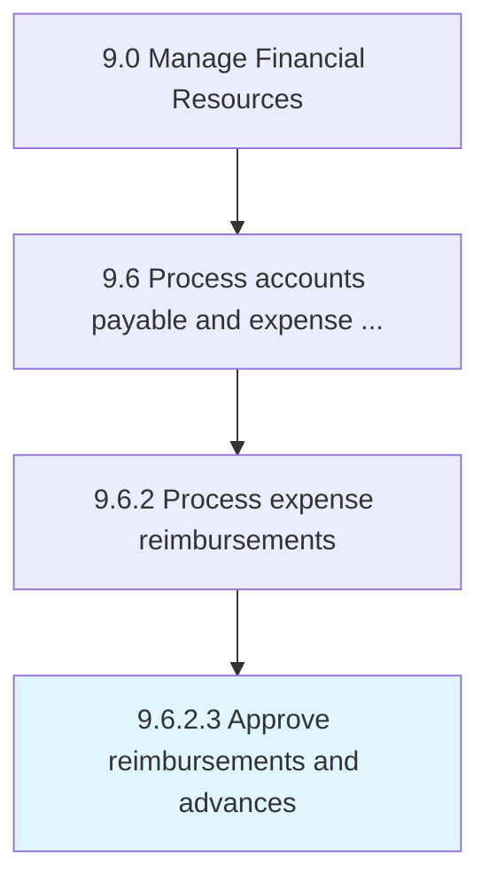

# Approve reimbursements and advances

> Permitting expense reimbursement requests from employees.

## Overview

Activity 9.6.2.3 is an activity within the Manage Financial Resources framework. 

Permitting expense reimbursement requests from employees.

## Process Hierarchy



## Key Statistics

| Metric | Value |
|--------|-------|
| APQC Code | 10882 |
| Hierarchy ID | 9.6.2.3 |
| Level | Activity |
| Parent | [9.6.2](../) |
| Sub-Processes | 0 |


## GraphDL Semantic Structure

```
approve.ReimbursementsAndAdvances
```

| Component | Value | Description |
|-----------|-------|-------------|
| Verb | `approve` | Primary action |
| Object | `reimbursements and advances` | Direct object |


## Related Concepts

- Reimbursements
- Advances


---

*Source: APQC PCF 10882 (9.6.2.3) - APQC*
