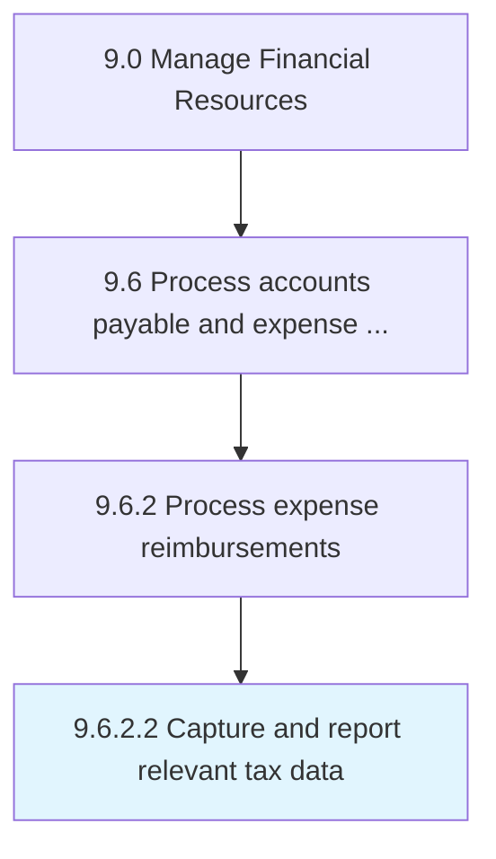

# Capture and report relevant tax data

> Collecting and reporting all pertinent information regarding the taxes paid by the organization's employees.

## Overview

Activity 9.6.2.2 is an activity within the Manage Financial Resources framework. 

Collecting and reporting all pertinent information regarding the taxes paid by the organization's employees.

## Process Hierarchy



## Key Statistics

| Metric | Value |
|--------|-------|
| APQC Code | 10881 |
| Hierarchy ID | 9.6.2.2 |
| Level | Activity |
| Parent | [9.6.2](../) |
| Sub-Processes | 0 |


## GraphDL Semantic Structure

```
capture.AndReportRelevantTaxData
```

| Component | Value | Description |
|-----------|-------|-------------|
| Verb | `capture` | Primary action |
| Object | `and report relevant tax data` | Direct object |


## Related Concepts

- RelevantTaxData
- RelevantTaxData


---

*Source: APQC PCF 10881 (9.6.2.2) - APQC*
