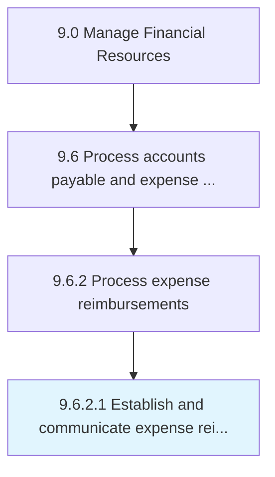

# Establish and communicate expense reimbursement policies and approval limits

> Explaining policies and procedures related to reimbursements requests by employees.

## Overview

Activity 9.6.2.1 is an activity within the Manage Financial Resources framework. 

Explaining policies and procedures related to reimbursements requests by employees. Set policies regarding reimbursement process and amount limits etc. Inform employees.

## Process Hierarchy



## Key Statistics

| Metric | Value |
|--------|-------|
| APQC Code | 10880 |
| Hierarchy ID | 9.6.2.1 |
| Level | Activity |
| Parent | [9.6.2](../) |
| Sub-Processes | 0 |


## GraphDL Semantic Structure

```
establish.AndCommunicateExpenseReimbursementPoliciesAndApprovalLimits
```

| Component | Value | Description |
|-----------|-------|-------------|
| Verb | `establish` | Primary action |
| Object | `and communicate expense reimbursement policies and approval limits` | Direct object |


## Related Concepts

- [ExpenseReimbursementPoliciesLimits](/concepts/ExpenseReimbursementPoliciesLimits)
- [ApprovalLimits](/concepts/ApprovalLimits)
- [ExpenseReimbursementPoliciesLimits](/concepts/ExpenseReimbursementPoliciesLimits)
- [ApprovalLimits](/concepts/ApprovalLimits)


---

*Source: APQC PCF 10880 (9.6.2.1) - APQC*
