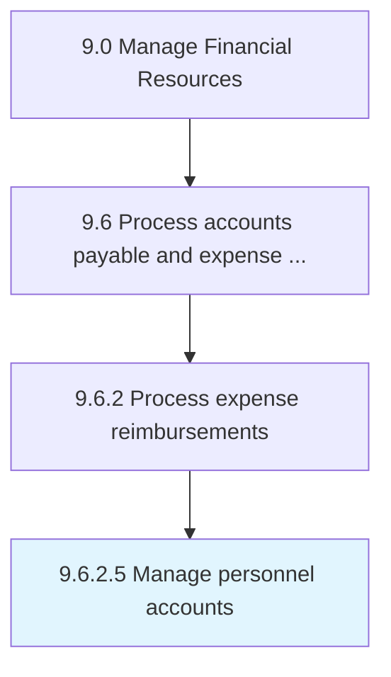

# Manage personnel accounts

> Maintaining accounts of individuals who are connected with business.

## Overview

Activity 9.6.2.5 is an activity within the Manage Financial Resources framework. 

Maintaining accounts of individuals who are connected with business.

## Process Hierarchy



## Key Statistics

| Metric | Value |
|--------|-------|
| APQC Code | 10884 |
| Hierarchy ID | 9.6.2.5 |
| Level | Activity |
| Parent | [9.6.2](../) |
| Sub-Processes | 0 |


## GraphDL Semantic Structure

```
manage.PersonnelAccounts
```

| Component | Value | Description |
|-----------|-------|-------------|
| Verb | `manage` | Primary action |
| Object | `personnel accounts` | Direct object |


## Related Concepts

- PersonnelAccounts


---

*Source: APQC PCF 10884 (9.6.2.5) - APQC*
