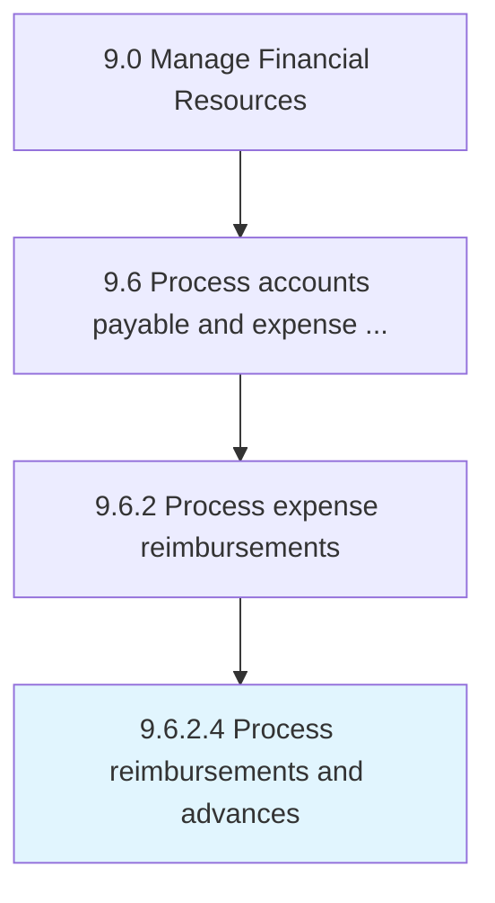

# Process reimbursements and advances

> Paying for expense reimbursement requests from employees.

## Overview

Activity 9.6.2.4 is an activity within the Manage Financial Resources framework. 

Paying for expense reimbursement requests from employees. (Follow Approve reimbursements and advances [10882] according to policies and conditions.)

## Process Hierarchy



## Key Statistics

| Metric | Value |
|--------|-------|
| APQC Code | 10883 |
| Hierarchy ID | 9.6.2.4 |
| Level | Activity |
| Parent | [9.6.2](../) |
| Sub-Processes | 0 |


## GraphDL Semantic Structure

```
process.ReimbursementsAndAdvances
```

| Component | Value | Description |
|-----------|-------|-------------|
| Verb | `process` | Primary action |
| Object | `reimbursements and advances` | Direct object |


## Related Concepts

- [Reimbursements](/concepts/Reimbursements)
- [Advances](/concepts/Advances)


---

*Source: APQC PCF 10883 (9.6.2.4) - APQC*
