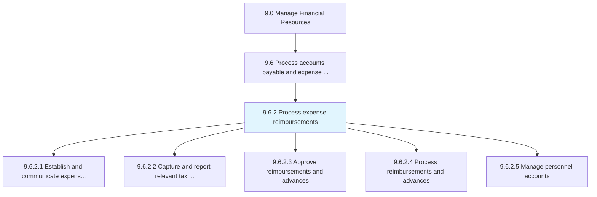
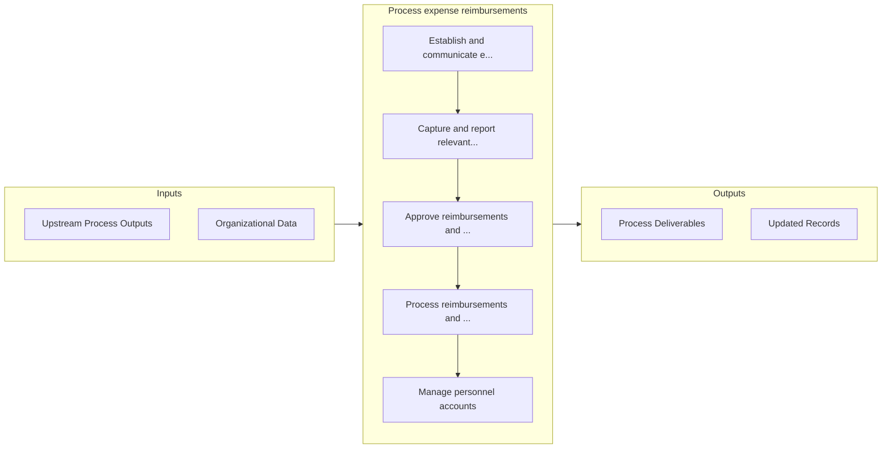

# Process expense reimbursements

> Processing reimbursements to employees for the expenses incurred during the course of business.

## Overview

Process 9.6.2 is a core process that defines the specific procedures for process expense reimbursements. 

Processing reimbursements to employees for the expenses incurred during the course of business. Approve and process advancements and reimbursements for employee expenses on the organization's behalf. Capture and report relevant tax data and manage personal accounts.

## Process Hierarchy



## Key Statistics

| Metric | Value |
|--------|-------|
| APQC Code | 10757 |
| Hierarchy ID | 9.6.2 |
| Level | Process |
| Parent | [9.6](../) |
| Sub-Processes | 5 |


## GraphDL Semantic Structure

```graphdl
process.ExpenseReimbursements
```

| Component | Value | Description |
|-----------|-------|-------------|
| Verb | `process` | Primary action |
| Object | `expense reimbursements` | Direct object |


## Process Flow



## Sub-Processes

| Process | Hierarchy ID | Description |
|---------|-------------|-------------|
| [Establish and communicate expense reimbursement policies and approval limits](./EstablishAndCommunicateExpenseReimbursementPoliciesAndApprovalLimits) | 9.6.2.1 | Explaining policies and procedures related to reimbursements requests by employees |
| [Capture and report relevant tax data](./CaptureAndReportRelevantTaxData) | 9.6.2.2 | Collecting and reporting all pertinent information regarding the taxes paid by the organization's em |
| [Approve reimbursements and advances](./ApproveReimbursementsAndAdvances) | 9.6.2.3 | Permitting expense reimbursement requests from employees |
| [Process reimbursements and advances](./ProcessReimbursementsAndAdvances) | 9.6.2.4 | Paying for expense reimbursement requests from employees |
| [Manage personnel accounts](./ManagePersonnelAccounts) | 9.6.2.5 | Maintaining accounts of individuals who are connected with business |


## Related Concepts

- ExpenseReimbursements


---

*Source: APQC PCF 10757 (9.6.2) - APQC*
