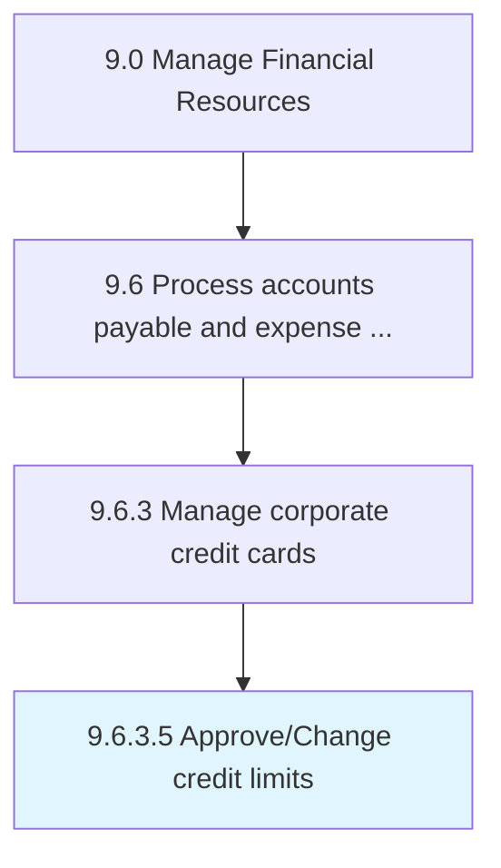

# Approve/Change credit limits

> Authorizing changes to the available credit advances.

## Overview

Activity 9.6.3.5 is an activity within the Manage Financial Resources framework. 

Authorizing changes to the available credit advances.

## Process Hierarchy



## Key Statistics

| Metric | Value |
|--------|-------|
| APQC Code | 20934 |
| Hierarchy ID | 9.6.3.5 |
| Level | Activity |
| Parent | [9.6.3](../) |
| Sub-Processes | 0 |


## GraphDL Semantic Structure

```
approve/change.CreditLimits
```

| Component | Value | Description |
|-----------|-------|-------------|
| Verb | `approve/change` | Primary action |
| Object | `credit limits` | Direct object |


## Related Concepts

- [CreditLimits](/concepts/CreditLimits)
- [CreditLimits](/concepts/CreditLimits)


---

*Source: APQC PCF 20934 (9.6.3.5) - APQC*
