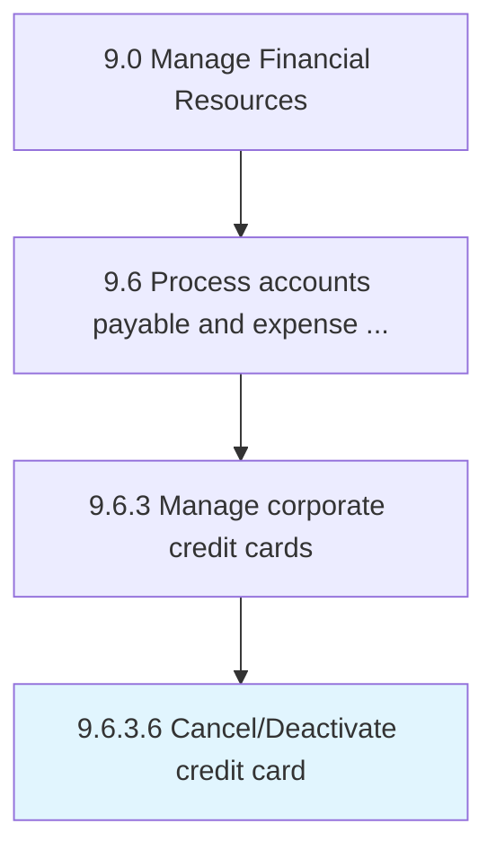

# Cancel/Deactivate credit card

> Blocking an existing credit card to disable all future transactions.

## Overview

Activity 9.6.3.6 is an activity within the Accounts Payable & Expense Reimbursement domain of the Manage Financial Resources framework.

Blocking an existing credit card to disable all future transactions. This activity plays a critical role in ensuring that the organization maintains sound financial governance, operational efficiency, and regulatory compliance. It supports upstream planning and downstream execution by providing structured outputs that inform decision-making across finance and business operations. Effective execution of this activity requires coordination among finance professionals, process owners, and leadership stakeholders to ensure accuracy, timeliness, and alignment with organizational objectives.

## Process Hierarchy



## Process Flow


## Key Statistics

| Metric | Value |
|--------|-------|
| APQC Code | 20935 |
| Hierarchy ID | 9.6.3.6 |
| Level | Activity |
| Parent | [9.6.3](../) |
| Sub-Processes | 0 |

## GraphDL Semantic Structure

```graphdl
cancel/deactivate.CreditCard
```

| Component | Value | Description |
|-----------|-------|-------------|
| Verb | `cancel/deactivate` | Primary action |
| Object | `credit card` | Direct object |

## RACI Matrix

| Activity | Responsible | Accountable | Consulted | Informed |
|----------|-------------|-------------|-----------|----------|
| Process invoices | AP Clerk | AP Manager | Procurement | Controller |
| Approve payments | AP Manager | Controller | Treasury | CFO |
| Manage expense reports | AP Specialist | AP Manager | Department Managers | Controller |

## Related Occupations

- [Financial Managers](/occupations/Management/FinancialManagers)
- [Accountants and Auditors](/occupations/Business/Financial/AccountantsAndAuditors)
- [Billing and Posting Clerks](/occupations/Administrative/BillingAndPostingClerks)
- [Bookkeeping Clerks](/occupations/Administrative/BookkeepingAccountingAndAuditingClerks)
- [Purchasing Agents](/occupations/Business/PurchasingAgentsExceptWholesaleRetailAndFarmProducts)

## Related Departments

- Accounts Payable
- Procurement
- Finance & Accounting

## Industry Variations

### Manufacturing

AP processes high volumes of raw material invoices with three-way matching against purchase orders and goods receipts.

### Healthcare

Manages complex vendor relationships for medical supplies, pharmaceuticals, and contracted services with group purchasing organization terms.

### Retail

Handles merchandise payables with trade discounts, markdown allowances, and cooperative advertising deductions.

## KPIs & Metrics

| Metric | Description | Target |
|--------|-------------|--------|
| Invoice Processing Time | Average days from receipt to payment | < 10 days |
| Early Payment Discount Capture | Percentage of available discounts taken | > 90% |
| Cost per Invoice | Total AP cost per invoice processed | < $3 |
| Straight-Through Processing Rate | Invoices processed without manual intervention | > 80% |

## Related Concepts

- CreditCard
- CreditCard

---

*Source: APQC PCF 20935 (9.6.3.6) - APQC*