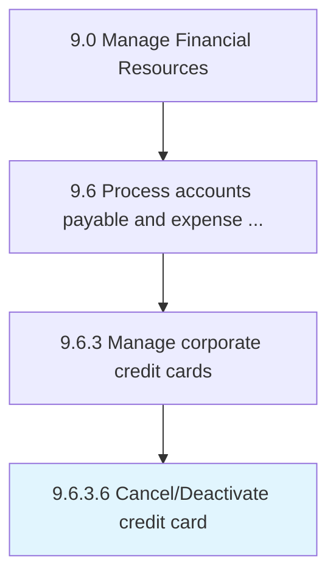

# Cancel/Deactivate credit card

> Blocking an existing credit card to disable all future transactions.

## Overview

Activity 9.6.3.6 is an activity within the Manage Financial Resources framework. 

Blocking an existing credit card to disable all future transactions.

## Process Hierarchy



## Key Statistics

| Metric | Value |
|--------|-------|
| APQC Code | 20935 |
| Hierarchy ID | 9.6.3.6 |
| Level | Activity |
| Parent | [9.6.3](../) |
| Sub-Processes | 0 |


## GraphDL Semantic Structure

```
cancel/deactivate.CreditCard
```

| Component | Value | Description |
|-----------|-------|-------------|
| Verb | `cancel/deactivate` | Primary action |
| Object | `credit card` | Direct object |


## Related Concepts

- [CreditCard](/concepts/CreditCard)
- [CreditCard](/concepts/CreditCard)


---

*Source: APQC PCF 20935 (9.6.3.6) - APQC*
