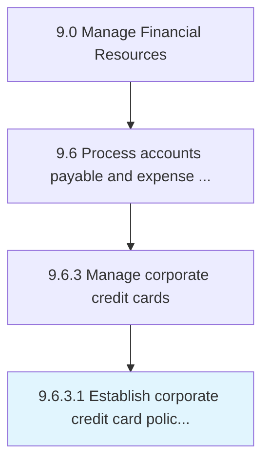

# Establish corporate credit card policies and approval limits

> Developing procedures for using company credit cards.

## Overview

Activity 9.6.3.1 is an activity within the Manage Financial Resources framework. 

Developing procedures for using company credit cards. Set or approve credit limits.

## Process Hierarchy



## Key Statistics

| Metric | Value |
|--------|-------|
| APQC Code | 20930 |
| Hierarchy ID | 9.6.3.1 |
| Level | Activity |
| Parent | [9.6.3](../) |
| Sub-Processes | 0 |


## GraphDL Semantic Structure

```
establish.CorporateCreditCardPoliciesAndApprovalLimits
```

| Component | Value | Description |
|-----------|-------|-------------|
| Verb | `establish` | Primary action |
| Object | `corporate credit card policies and approval limits` | Direct object |


## Related Concepts

- CorporateCreditCardPoliciesLimits
- ApprovalLimits


---

*Source: APQC PCF 20930 (9.6.3.1) - APQC*
