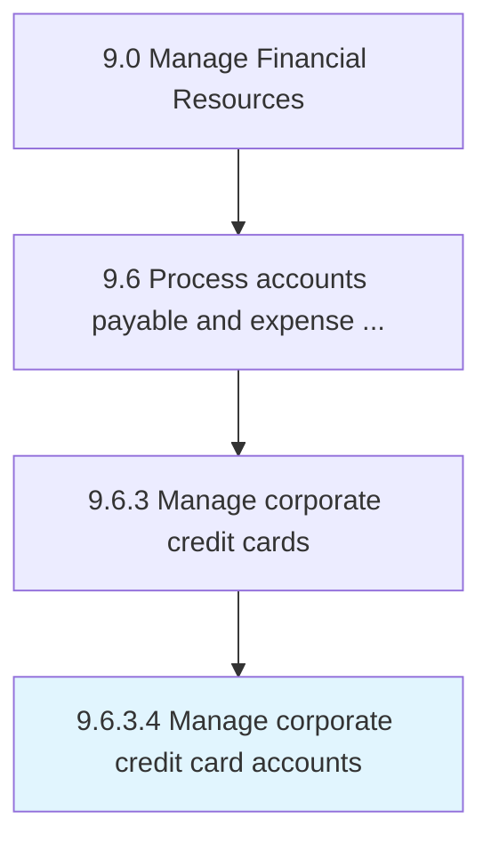

# Manage corporate credit card accounts

> Handling credit card accounts of business customers.

## Overview

Activity 9.6.3.4 is an activity within the Manage Financial Resources framework. 

Handling credit card accounts of business customers.

## Process Hierarchy



## Key Statistics

| Metric | Value |
|--------|-------|
| APQC Code | 20933 |
| Hierarchy ID | 9.6.3.4 |
| Level | Activity |
| Parent | [9.6.3](../) |
| Sub-Processes | 0 |


## GraphDL Semantic Structure

```
manage.CorporateCreditCardAccounts
```

| Component | Value | Description |
|-----------|-------|-------------|
| Verb | `manage` | Primary action |
| Object | `corporate credit card accounts` | Direct object |


## Related Concepts

- CorporateCreditCardAccounts


---

*Source: APQC PCF 20933 (9.6.3.4) - APQC*
