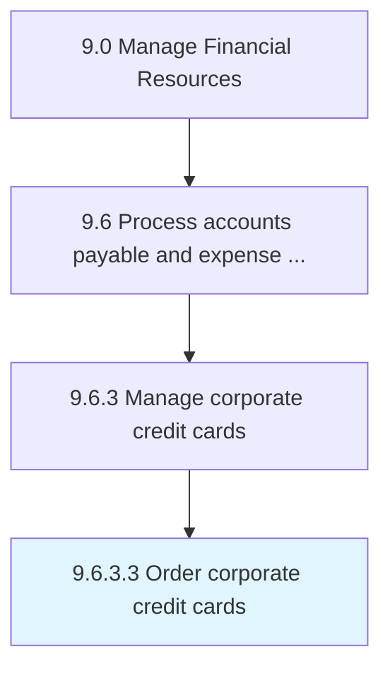

# Order corporate credit cards

> Obtaining credit cards for business-related expenses.

## Overview

Activity 9.6.3.3 is an activity within the Manage Financial Resources framework. 

Obtaining credit cards for business-related expenses.

## Process Hierarchy



## Key Statistics

| Metric | Value |
|--------|-------|
| APQC Code | 20932 |
| Hierarchy ID | 9.6.3.3 |
| Level | Activity |
| Parent | [9.6.3](../) |
| Sub-Processes | 0 |


## GraphDL Semantic Structure

```
order.CorporateCreditCards
```

| Component | Value | Description |
|-----------|-------|-------------|
| Verb | `order` | Primary action |
| Object | `corporate credit cards` | Direct object |


## Related Concepts

- [CorporateCreditCards](/concepts/CorporateCreditCards)


---

*Source: APQC PCF 20932 (9.6.3.3) - APQC*
