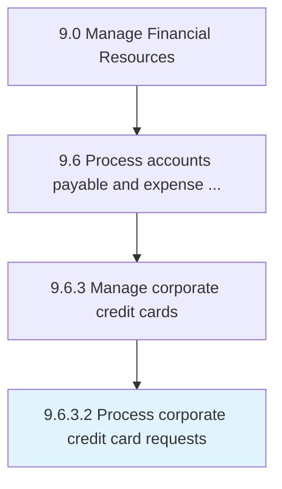

# Process corporate credit card requests

> Handling applications credit card applications for business expenses.

## Overview

Activity 9.6.3.2 is an activity within the Manage Financial Resources framework. 

Handling applications credit card applications for business expenses.

## Process Hierarchy



## Key Statistics

| Metric | Value |
|--------|-------|
| APQC Code | 20931 |
| Hierarchy ID | 9.6.3.2 |
| Level | Activity |
| Parent | [9.6.3](../) |
| Sub-Processes | 0 |


## GraphDL Semantic Structure

```
process.CorporateCreditCardRequests
```

| Component | Value | Description |
|-----------|-------|-------------|
| Verb | `process` | Primary action |
| Object | `corporate credit card requests` | Direct object |


## Related Concepts

- CorporateCreditCardRequests


---

*Source: APQC PCF 20931 (9.6.3.2) - APQC*
