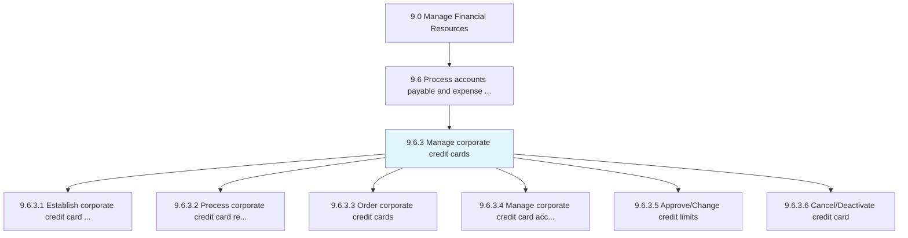
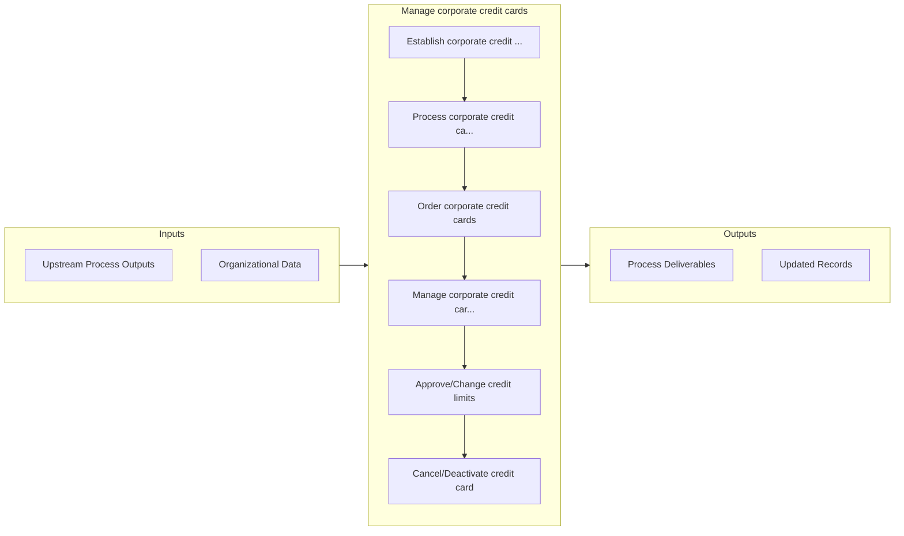

# Manage corporate credit cards

> Handling and authoring credit cards to business entities or for corporate purchases.

## Overview

Process 9.6.3 is a core process that defines the specific procedures for manage corporate credit cards. 

Handling and authoring credit cards to business entities or for corporate purchases.

## Process Hierarchy



## Key Statistics

| Metric | Value |
|--------|-------|
| APQC Code | 20929 |
| Hierarchy ID | 9.6.3 |
| Level | Process |
| Parent | [9.6](../) |
| Sub-Processes | 6 |


## GraphDL Semantic Structure

```graphdl
manage.CorporateCreditCards
```

| Component | Value | Description |
|-----------|-------|-------------|
| Verb | `manage` | Primary action |
| Object | `corporate credit cards` | Direct object |


## Process Flow



## Sub-Processes

| Process | Hierarchy ID | Description |
|---------|-------------|-------------|
| [Establish corporate credit card policies and approval limits](./EstablishCorporateCreditCardPoliciesAndApprovalLimits) | 9.6.3.1 | Developing procedures for using company credit cards |
| [Process corporate credit card requests](./ProcessCorporateCreditCardRequests) | 9.6.3.2 | Handling applications credit card applications for business expenses |
| [Order corporate credit cards](./OrderCorporateCreditCards) | 9.6.3.3 | Obtaining credit cards for business-related expenses |
| [Manage corporate credit card accounts](./ManageCorporateCreditCardAccounts) | 9.6.3.4 | Handling credit card accounts of business customers |
| [Approve/Change credit limits](./ApproveChangeCreditLimits) | 9.6.3.5 | Authorizing changes to the available credit advances |
| [Cancel/Deactivate credit card](./CancelDeactivateCreditCard) | 9.6.3.6 | Blocking an existing credit card to disable all future transactions |


## Related Concepts

- CorporateCreditCards


---

*Source: APQC PCF 20929 (9.6.3) - APQC*
