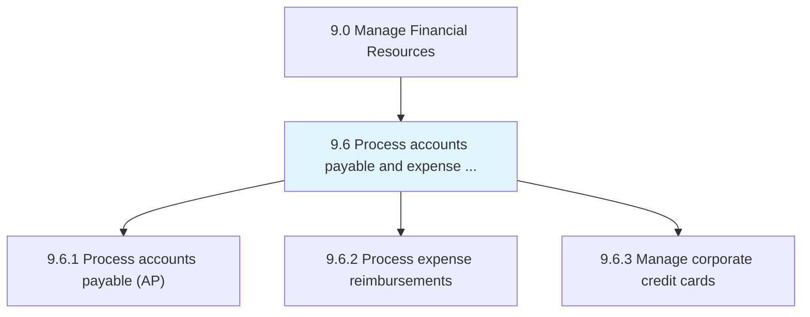
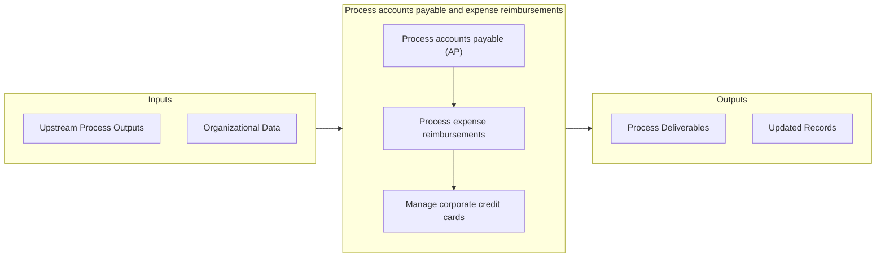

# Process accounts payable and expense reimbursements

> Handling bills and reimbursements to be made.

## Overview

Group 9.6 is a process group within APQC Category 9.0 (Manage Financial Resources). 

Handling bills and reimbursements to be made. Make payments for goods or services taken or used on behalf of the organization.

## Process Hierarchy



## Key Statistics

| Metric | Value |
|--------|-------|
| APQC Code | 10733 |
| Hierarchy ID | 9.6 |
| Level | Group |
| Parent | [9](../) |
| Sub-Processes | 3 |


## GraphDL Semantic Structure

```
process.AccountsPayableAndExpenseReimbursements
```

| Component | Value | Description |
|-----------|-------|-------------|
| Verb | `process` | Primary action |
| Object | `accounts payable and expense reimbursements` | Direct object |


## Process Flow



## Sub-Processes

| Process | Hierarchy ID | Description |
|---------|-------------|-------------|
| [Process accounts payable (AP)](./9.6.1-ProcessAccountsPayableAP/) | 9.6.1 | Processing payments of operating expenses and other supplier charges |
| [Process expense reimbursements](./9.6.2-ProcessExpenseReimbursements/) | 9.6.2 | Processing reimbursements to employees for the expenses incurred during the course of business |
| [Manage corporate credit cards](./9.6.3-ManageCorporateCreditCards/) | 9.6.3 | Handling and authoring credit cards to business entities or for corporate purchases |


## Related Concepts

- [AccountsPayableReimbursements](/concepts/AccountsPayableReimbursements)
- [ExpenseReimbursements](/concepts/ExpenseReimbursements)


---

*Source: APQC PCF 10733 (9.6) - APQC*
