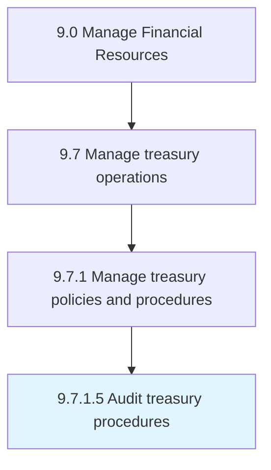

# Audit treasury procedures

> Auditing the treasury function.

## Overview

Activity 9.7.1.5 is an activity within the Manage Financial Resources framework. 

## Process Hierarchy



## Key Statistics

| Metric | Value |
|--------|-------|
| APQC Code | 10889 |
| Hierarchy ID | 9.7.1.5 |
| Level | Activity |
| Parent | [9.7.1](../) |
| Sub-Processes | 0 |


## GraphDL Semantic Structure

```
audit.TreasuryProcedures
```

| Component | Value | Description |
|-----------|-------|-------------|
| Verb | `audit` | Primary action |
| Object | `treasury procedures` | Direct object |


## Related Concepts

- TreasuryProcedures


---

*Source: APQC PCF 10889 (9.7.1.5) - APQC*
