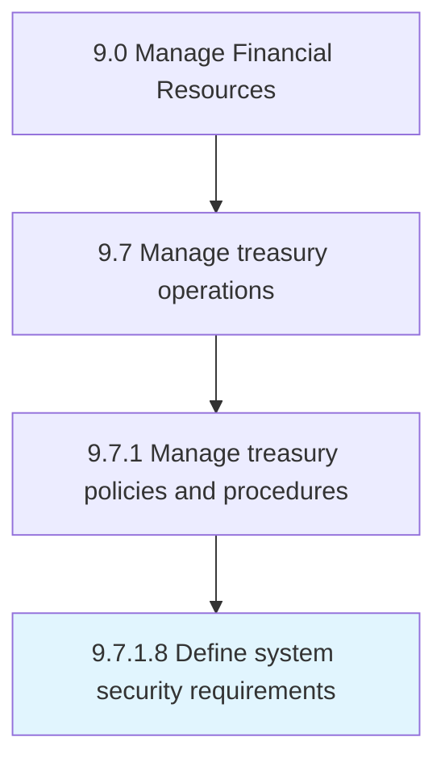

# Define system security requirements

> Describing the need of system security requirements for controlling access, reliability of information, accountability, and availability of information in the organization.

## Overview

Activity 9.7.1.8 is an activity within the Manage Financial Resources framework. 

Describing the need of system security requirements for controlling access, reliability of information, accountability, and availability of information in the organization.

## Process Hierarchy



## Key Statistics

| Metric | Value |
|--------|-------|
| APQC Code | 10892 |
| Hierarchy ID | 9.7.1.8 |
| Level | Activity |
| Parent | [9.7.1](../) |
| Sub-Processes | 0 |


## GraphDL Semantic Structure

```
define.SystemSecurityRequirements
```

| Component | Value | Description |
|-----------|-------|-------------|
| Verb | `define` | Primary action |
| Object | `system security requirements` | Direct object |


## Related Concepts

- [SystemSecurityRequirements](/concepts/SystemSecurityRequirements)


---

*Source: APQC PCF 10892 (9.7.1.8) - APQC*
