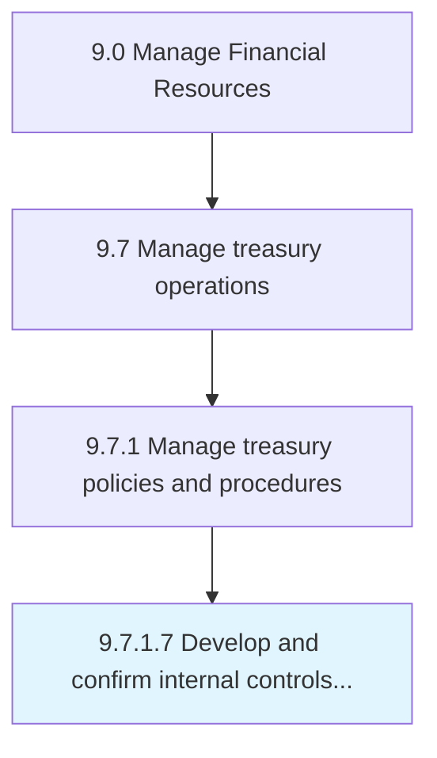

# Develop and confirm internal controls for treasury

> Creating and managing the internal control systems for investments in bonds, currencies, and financial derivatives to verify procedures.

## Overview

Activity 9.7.1.7 is an activity within the Manage Financial Resources framework. 

Creating and managing the internal control systems for investments in bonds, currencies, and financial derivatives to verify procedures.

## Process Hierarchy



## Key Statistics

| Metric | Value |
|--------|-------|
| APQC Code | 10891 |
| Hierarchy ID | 9.7.1.7 |
| Level | Activity |
| Parent | [9.7.1](../) |
| Sub-Processes | 0 |


## GraphDL Semantic Structure

```
develop.AndConfirmInternalControls.for.Treasury
```

| Component | Value | Description |
|-----------|-------|-------------|
| Verb | `develop` | Primary action |
| Object | `and confirm internal controls` | Direct object |
| Preposition | `for` | Relationship |
| PrepObject | `treasury` | Indirect object |


## Related Concepts

- InternalControls
- Treasury
- InternalControls
- Treasury


---

*Source: APQC PCF 10891 (9.7.1.7) - APQC*
