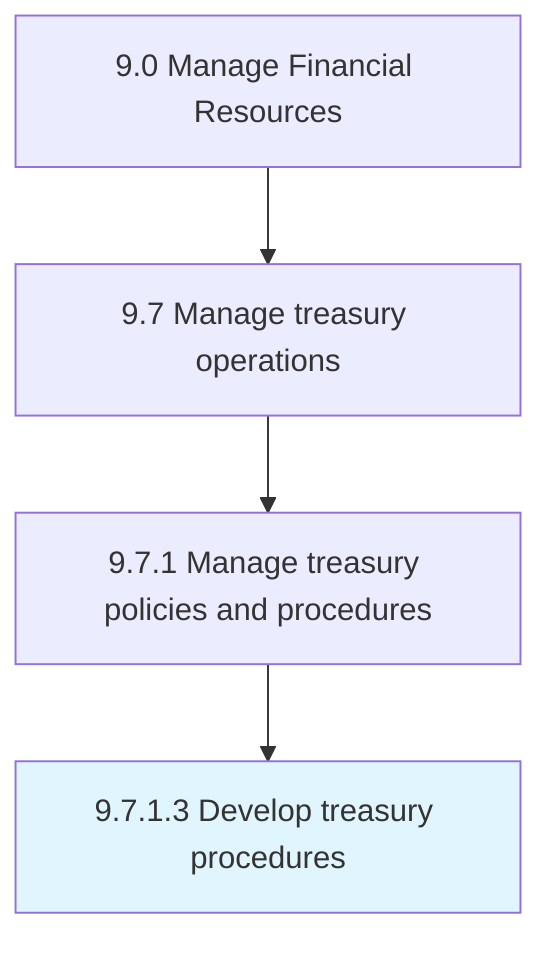

# Develop treasury procedures

> Making processes for investing.

## Overview

Activity 9.7.1.3 is an activity within the Manage Financial Resources framework. 

Making processes for investing. Create steps for investments in bonds, currencies, and financial derivatives in order to optimize company's liquidity, invest excess cash, and reduce its financial risks.

## Process Hierarchy



## Key Statistics

| Metric | Value |
|--------|-------|
| APQC Code | 10887 |
| Hierarchy ID | 9.7.1.3 |
| Level | Activity |
| Parent | [9.7.1](../) |
| Sub-Processes | 0 |


## GraphDL Semantic Structure

```
develop.TreasuryProcedures
```

| Component | Value | Description |
|-----------|-------|-------------|
| Verb | `develop` | Primary action |
| Object | `treasury procedures` | Direct object |


## Related Concepts

- TreasuryProcedures


---

*Source: APQC PCF 10887 (9.7.1.3) - APQC*
