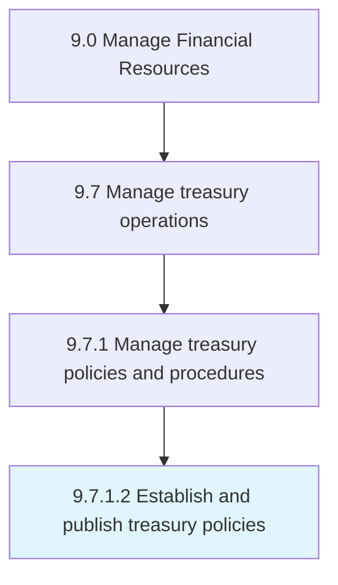

# Establish and publish treasury policies

> Creating and providing investment regulations for the organization.

## Overview

Activity 9.7.1.2 is an activity within the Manage Financial Resources framework. 

Creating and providing investment regulations for the organization. Establish policies and procedures for investments to optimize liquidity in treasury operations. Create a written copy of it.

## Process Hierarchy



## Key Statistics

| Metric | Value |
|--------|-------|
| APQC Code | 10886 |
| Hierarchy ID | 9.7.1.2 |
| Level | Activity |
| Parent | [9.7.1](../) |
| Sub-Processes | 0 |


## GraphDL Semantic Structure

```
establish.AndPublishTreasuryPolicies
```

| Component | Value | Description |
|-----------|-------|-------------|
| Verb | `establish` | Primary action |
| Object | `and publish treasury policies` | Direct object |


## Related Concepts

- [TreasuryPolicies](/concepts/TreasuryPolicies)
- [TreasuryPolicies](/concepts/TreasuryPolicies)


---

*Source: APQC PCF 10886 (9.7.1.2) - APQC*
