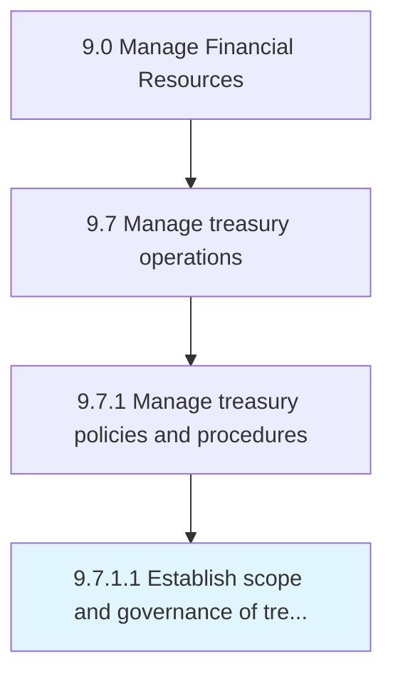

# Establish scope and governance of treasury operations

> Selecting opportunities and the authoritative body for investments in trading in bonds, currencies, financial derivatives, etc.

## Overview

Activity 9.7.1.1 is an activity within the Manage Financial Resources framework. 

Selecting opportunities and the authoritative body for investments in trading in bonds, currencies, financial derivatives, etc.

## Process Hierarchy



## Key Statistics

| Metric | Value |
|--------|-------|
| APQC Code | 10885 |
| Hierarchy ID | 9.7.1.1 |
| Level | Activity |
| Parent | [9.7.1](../) |
| Sub-Processes | 0 |


## GraphDL Semantic Structure

```
establish.ScopeAndGovernance.of.TreasuryOperations
```

| Component | Value | Description |
|-----------|-------|-------------|
| Verb | `establish` | Primary action |
| Object | `scope and governance` | Direct object |
| Preposition | `of` | Relationship |
| PrepObject | `treasury operations` | Indirect object |


## Related Concepts

- [Scope](/concepts/Scope)
- [TreasuryOperations](/concepts/TreasuryOperations)
- [Governance](/concepts/Governance)
- [TreasuryOperations](/concepts/TreasuryOperations)


---

*Source: APQC PCF 10885 (9.7.1.1) - APQC*
