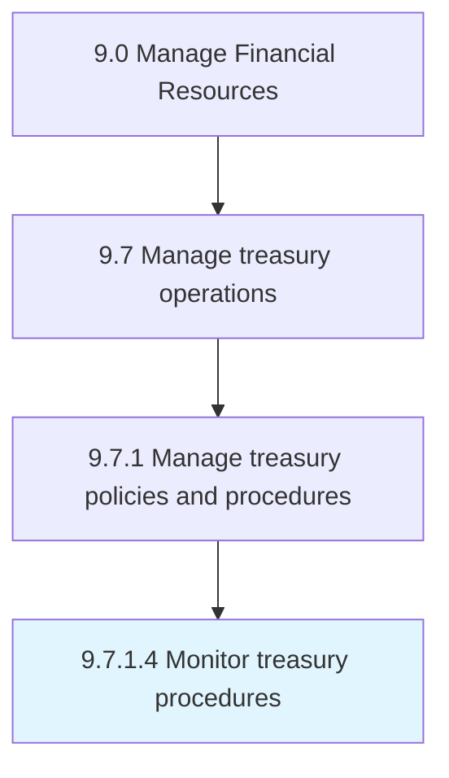

# Monitor treasury procedures

> Checking treasury processes in order to optimize company's liquidity, invest excess cash, and reduce its financial risks.

## Overview

Activity 9.7.1.4 is an activity within the Manage Financial Resources framework. 

Checking treasury processes in order to optimize company's liquidity, invest excess cash, and reduce its financial risks.

## Process Hierarchy



## Key Statistics

| Metric | Value |
|--------|-------|
| APQC Code | 10888 |
| Hierarchy ID | 9.7.1.4 |
| Level | Activity |
| Parent | [9.7.1](../) |
| Sub-Processes | 0 |


## GraphDL Semantic Structure

```
monitor.TreasuryProcedures
```

| Component | Value | Description |
|-----------|-------|-------------|
| Verb | `monitor` | Primary action |
| Object | `treasury procedures` | Direct object |


## Related Concepts

- [TreasuryProcedures](/concepts/TreasuryProcedures)


---

*Source: APQC PCF 10888 (9.7.1.4) - APQC*
