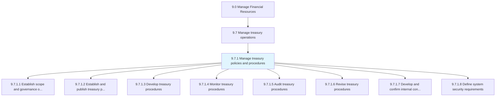
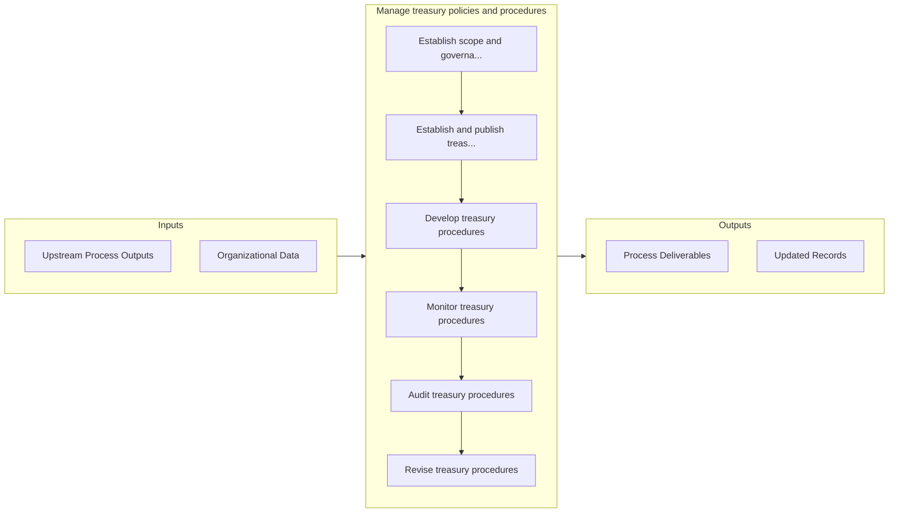

# Manage treasury policies and procedures

> Managing rules and regulations for investments in trading in bonds, currencies, financial derivatives, etc.

## Overview

Process 9.7.1 is a core process that defines the specific procedures for manage treasury policies and procedures. 

Managing rules and regulations for investments in trading in bonds, currencies, financial derivatives, etc. Establish policies and procedures for investments made. Optimize liquidity in treasury operations.

## Process Hierarchy



## Key Statistics

| Metric | Value |
|--------|-------|
| APQC Code | 10758 |
| Hierarchy ID | 9.7.1 |
| Level | Process |
| Parent | [9.7](../) |
| Sub-Processes | 8 |


## GraphDL Semantic Structure

```
manage.TreasuryPoliciesAndProcedures
```

| Component | Value | Description |
|-----------|-------|-------------|
| Verb | `manage` | Primary action |
| Object | `treasury policies and procedures` | Direct object |


## Process Flow



## Sub-Processes

| Process | Hierarchy ID | Description |
|---------|-------------|-------------|
| [Establish scope and governance of treasury operations](./EstablishScopeAndGovernanceOfTreasuryOperations) | 9.7.1.1 | Selecting opportunities and the authoritative body for investments in trading in bonds, currencies,  |
| [Establish and publish treasury policies](./EstablishAndPublishTreasuryPolicies) | 9.7.1.2 | Creating and providing investment regulations for the organization |
| [Develop treasury procedures](./DevelopTreasuryProcedures) | 9.7.1.3 | Making processes for investing |
| [Monitor treasury procedures](./MonitorTreasuryProcedures) | 9.7.1.4 | Checking treasury processes in order to optimize company's liquidity, invest excess cash, and reduce |
| [Audit treasury procedures](./AuditTreasuryProcedures) | 9.7.1.5 | Auditing the treasury function |
| [Revise treasury procedures](./ReviseTreasuryProcedures) | 9.7.1.6 | Reassessing all treasury procedures based on audit findings |
| [Develop and confirm internal controls for treasury](./DevelopAndConfirmInternalControlsForTreasury) | 9.7.1.7 | Creating and managing the internal control systems for investments in bonds, currencies, and financi |
| [Define system security requirements](./DefineSystemSecurityRequirements) | 9.7.1.8 | Describing the need of system security requirements for controlling access, reliability of informati |


## Related Concepts

- TreasuryPolicies
- Procedures


---

*Source: APQC PCF 10758 (9.7.1) - APQC*
