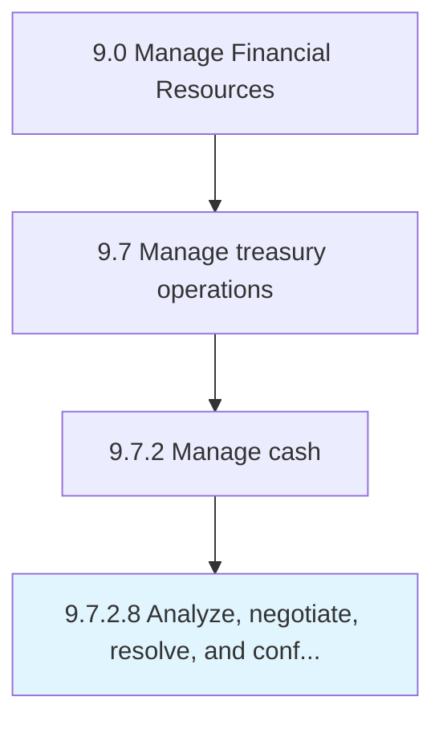

# Analyze, negotiate, resolve, and confirm bank fees

> Studying and finalizing bank fees for services provided by banks.

## Overview

Activity 9.7.2.8 is an activity within the Manage Financial Resources framework. 

Studying and finalizing bank fees for services provided by banks. Negotiate and finalize nominal fees that bank charges for various services, such as requesting a deposit slip or counter check or certifying papers.

## Process Hierarchy



## Key Statistics

| Metric | Value |
|--------|-------|
| APQC Code | 10900 |
| Hierarchy ID | 9.7.2.8 |
| Level | Activity |
| Parent | [9.7.2](../) |
| Sub-Processes | 0 |


## GraphDL Semantic Structure

```
analyze,.NegotiateResolveAndConfirmBankFees
```

| Component | Value | Description |
|-----------|-------|-------------|
| Verb | `analyze,` | Primary action |
| Object | `negotiate, resolve, and confirm bank fees` | Direct object |


## Related Concepts

- [BankFees](/concepts/BankFees)
- [BankFees](/concepts/BankFees)
- [BankFees](/concepts/BankFees)
- [BankFees](/concepts/BankFees)


---

*Source: APQC PCF 10900 (9.7.2.8) - APQC*
