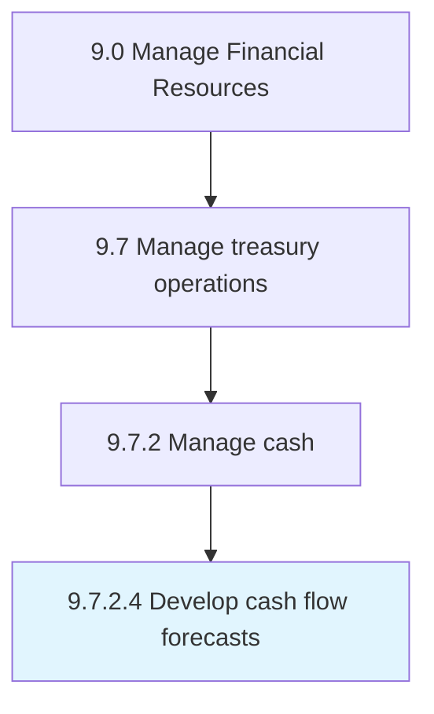

# Develop cash flow forecasts

> Preparing forecasts for the cash generated or used by the organization.

## Overview

Activity 9.7.2.4 is an activity within the Manage Financial Resources framework. 

Preparing forecasts for the cash generated or used by the organization.

## Process Hierarchy



## Key Statistics

| Metric | Value |
|--------|-------|
| APQC Code | 10896 |
| Hierarchy ID | 9.7.2.4 |
| Level | Activity |
| Parent | [9.7.2](../) |
| Sub-Processes | 0 |


## GraphDL Semantic Structure

```
develop.CashFlowForecasts
```

| Component | Value | Description |
|-----------|-------|-------------|
| Verb | `develop` | Primary action |
| Object | `cash flow forecasts` | Direct object |


## Related Concepts

- CashFlowForecasts


---

*Source: APQC PCF 10896 (9.7.2.4) - APQC*
