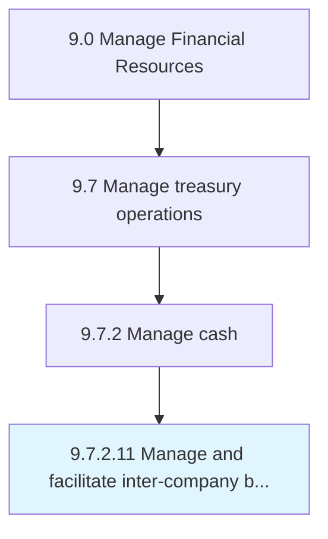

# Manage and facilitate inter-company borrowing transactions

> Arranging loans for subsidiaries from in-house banks.

## Overview

Activity 9.7.2.11 is an activity within the Manage Financial Resources framework. 

Arranging loans for subsidiaries from in-house banks.

## Process Hierarchy



## Key Statistics

| Metric | Value |
|--------|-------|
| APQC Code | 10902 |
| Hierarchy ID | 9.7.2.11 |
| Level | Activity |
| Parent | [9.7.2](../) |
| Sub-Processes | 0 |


## GraphDL Semantic Structure

```
manage.AndFacilitateIntercompanyBorrowingTransactions
```

| Component | Value | Description |
|-----------|-------|-------------|
| Verb | `manage` | Primary action |
| Object | `and facilitate inter-company borrowing transactions` | Direct object |


---

*Source: APQC PCF 10902 (9.7.2.11) - APQC*
