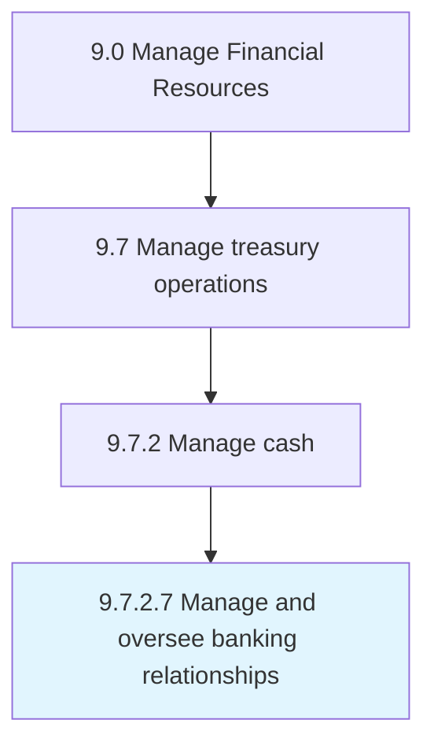

# Manage and oversee banking relationships

> Maintaining and directing the course of relationships with banking partners.

## Overview

Activity 9.7.2.7 is an activity within the Manage Financial Resources framework. 

Maintaining and directing the course of relationships with banking partners.

## Process Hierarchy



## Key Statistics

| Metric | Value |
|--------|-------|
| APQC Code | 10899 |
| Hierarchy ID | 9.7.2.7 |
| Level | Activity |
| Parent | [9.7.2](../) |
| Sub-Processes | 0 |


## GraphDL Semantic Structure

```
manage.AndOverseeBankingRelationships
```

| Component | Value | Description |
|-----------|-------|-------------|
| Verb | `manage` | Primary action |
| Object | `and oversee banking relationships` | Direct object |


## Related Concepts

- [BankingRelationships](/concepts/BankingRelationships)
- [BankingRelationships](/concepts/BankingRelationships)


---

*Source: APQC PCF 10899 (9.7.2.7) - APQC*
