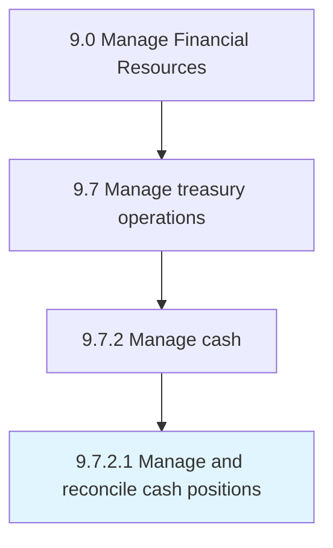

# Manage and reconcile cash positions

> Correcting cash differences in the books of accounts.

## Overview

Activity 9.7.2.1 is an activity within the Manage Financial Resources framework. 

Correcting cash differences in the books of accounts. Make optimum utilization of funds available in the business. Check for differences to rectify.

## Process Hierarchy



## Key Statistics

| Metric | Value |
|--------|-------|
| APQC Code | 10893 |
| Hierarchy ID | 9.7.2.1 |
| Level | Activity |
| Parent | [9.7.2](../) |
| Sub-Processes | 0 |


## GraphDL Semantic Structure

```
manage.AndReconcileCashPositions
```

| Component | Value | Description |
|-----------|-------|-------------|
| Verb | `manage` | Primary action |
| Object | `and reconcile cash positions` | Direct object |


## Related Concepts

- CashPositions
- CashPositions


---

*Source: APQC PCF 10893 (9.7.2.1) - APQC*
