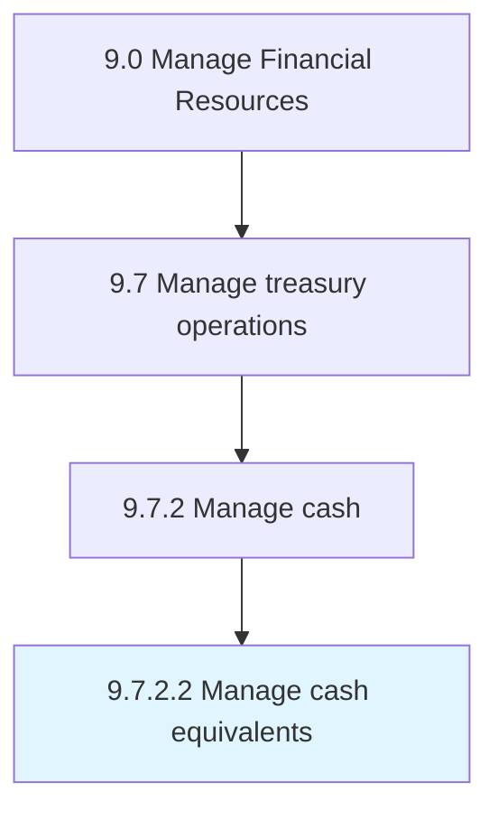

# Manage cash equivalents

> Taking care of all cash-related activities in the business.

## Overview

Activity 9.7.2.2 is an activity within the Manage Financial Resources framework. 

Taking care of all cash-related activities in the business. Utilize short-term assets that can be easily convertible into cash, such as marketable securities, commercial paper and short-term government bonds, and treasury bills.

## Process Hierarchy



## Key Statistics

| Metric | Value |
|--------|-------|
| APQC Code | 10894 |
| Hierarchy ID | 9.7.2.2 |
| Level | Activity |
| Parent | [9.7.2](../) |
| Sub-Processes | 0 |


## GraphDL Semantic Structure

```
manage.CashEquivalents
```

| Component | Value | Description |
|-----------|-------|-------------|
| Verb | `manage` | Primary action |
| Object | `cash equivalents` | Direct object |


## Related Concepts

- [CashEquivalents](/concepts/CashEquivalents)


---

*Source: APQC PCF 10894 (9.7.2.2) - APQC*
