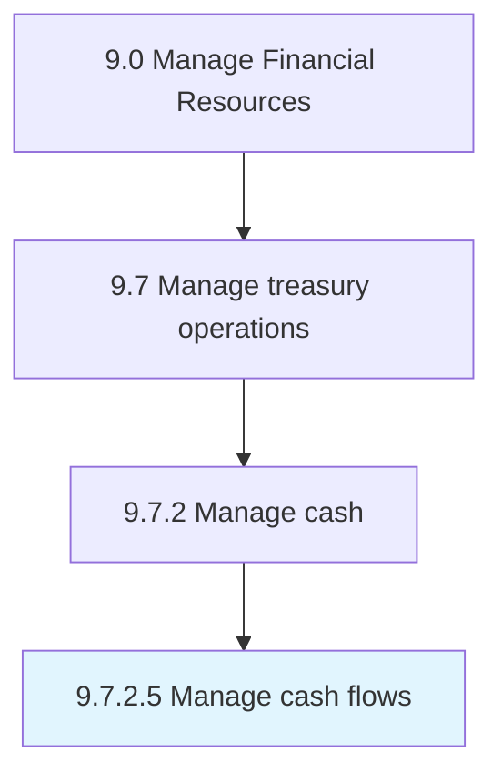

# Manage cash flows

> Delaying the outflow of funds as long as possible, but encourage the inflow of as fast as possible.

## Overview

Activity 9.7.2.5 is an activity within the Manage Financial Resources framework. 

Delaying the outflow of funds as long as possible, but encourage the inflow of as fast as possible.

## Process Hierarchy



## Key Statistics

| Metric | Value |
|--------|-------|
| APQC Code | 10897 |
| Hierarchy ID | 9.7.2.5 |
| Level | Activity |
| Parent | [9.7.2](../) |
| Sub-Processes | 0 |


## GraphDL Semantic Structure

```
manage.CashFlows
```

| Component | Value | Description |
|-----------|-------|-------------|
| Verb | `manage` | Primary action |
| Object | `cash flows` | Direct object |


## Related Concepts

- CashFlows


---

*Source: APQC PCF 10897 (9.7.2.5) - APQC*
