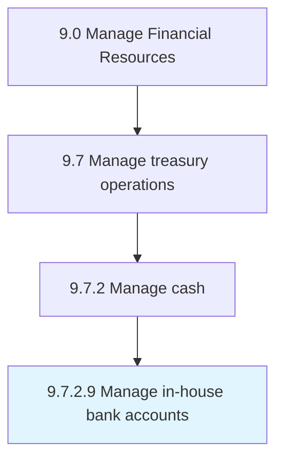
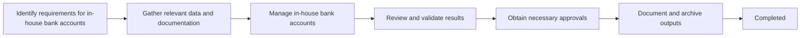
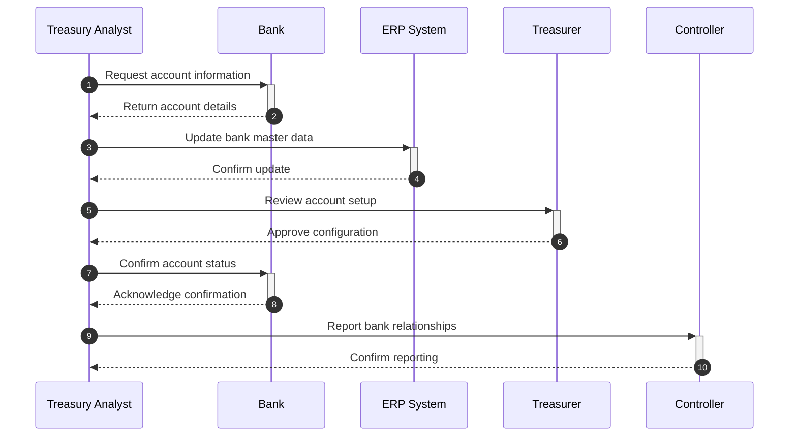

# Manage in-house bank accounts

> Managing financial services provided by an in-house bank structure in the corporation that is operating like a commercial bank.

## Overview

Activity 9.7.2.9 is an activity within the Treasury Management domain of the Manage Financial Resources framework.

Managing financial services provided by an in-house bank structure in the corporation that is operating like a commercial bank. This activity plays a critical role in ensuring that the organization maintains sound financial governance, operational efficiency, and regulatory compliance. It supports upstream planning and downstream execution by providing structured outputs that inform decision-making across finance and business operations. Effective execution of this activity requires coordination among finance professionals, process owners, and leadership stakeholders to ensure accuracy, timeliness, and alignment with organizational objectives.

## Process Hierarchy



## Process Flow



## Key Statistics

| Metric | Value |
|--------|-------|
| APQC Code | 10760 |
| Hierarchy ID | 9.7.2.9 |
| Level | Activity |
| Parent | [9.7.2](../) |
| Sub-Processes | 0 |

## GraphDL Semantic Structure

```graphdl
manage.InhouseBankAccounts
```

| Component | Value | Description |
|-----------|-------|-------------|
| Verb | `manage` | Primary action |
| Object | `in-house bank accounts` | Direct object |

## RACI Matrix

| Activity | Responsible | Accountable | Consulted | Informed |
|----------|-------------|-------------|-----------|----------|
| Manage cash positions | Treasury Analyst | Treasurer | Controller | CFO |
| Execute investments | Treasury Analyst | Treasurer | Investment Committee | CFO |
| Manage bank relationships | Treasurer | CFO | Legal | Controller |

## Related Occupations

- [Financial Managers](/occupations/Management/FinancialManagers)
- [Accountants and Auditors](/occupations/Business/Financial/AccountantsAndAuditors)
- [Treasurers and Controllers](/occupations/Treasurers)
- [Financial Analysts](/occupations/Business/Financial/FinancialAnalysts)
- [Loan Officers](/occupations/Business/LoanOfficers)

## Related Departments

- Treasury
- Corporate Finance
- Finance & Accounting

## Industry Variations

### Banking

Treasury operations include interbank lending, reserve management, and liquidity coverage ratio compliance.

### Multinational Corporations

Manages multi-currency cash pools, cross-border netting, and foreign exchange hedging strategies.

### Energy

Treasury handles commodity hedging, project finance structures, and long-term power purchase agreement management.

## KPIs & Metrics

| Metric | Description | Target |
|--------|-------------|--------|
| Cash Forecast Accuracy | Accuracy of short-term cash forecasts | > 95% |
| Idle Cash Ratio | Percentage of cash not optimally deployed | < 5% |
| Borrowing Cost | Weighted average cost of debt | Below benchmark |
| FX Hedge Effectiveness | Effectiveness of currency hedging programs | > 80% |

## Process Sequence



## Related Concepts


---

*Source: APQC PCF 10760 (9.7.2.9) - APQC*