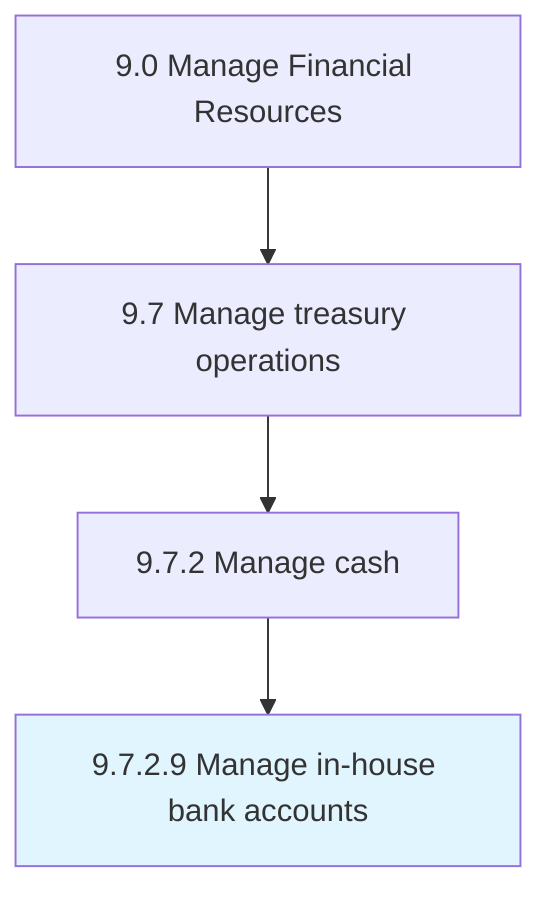

# Manage in-house bank accounts

> Managing financial services provided by an in-house bank structure in the corporation that is operating like a commercial bank.

## Overview

Activity 9.7.2.9 is an activity within the Manage Financial Resources framework. 

Managing financial services provided by an in-house bank structure in the corporation that is operating like a commercial bank.

## Process Hierarchy



## Key Statistics

| Metric | Value |
|--------|-------|
| APQC Code | 10760 |
| Hierarchy ID | 9.7.2.9 |
| Level | Activity |
| Parent | [9.7.2](../) |
| Sub-Processes | 0 |


## GraphDL Semantic Structure

```
manage.InhouseBankAccounts
```

| Component | Value | Description |
|-----------|-------|-------------|
| Verb | `manage` | Primary action |
| Object | `in-house bank accounts` | Direct object |


---

*Source: APQC PCF 10760 (9.7.2.9) - APQC*
