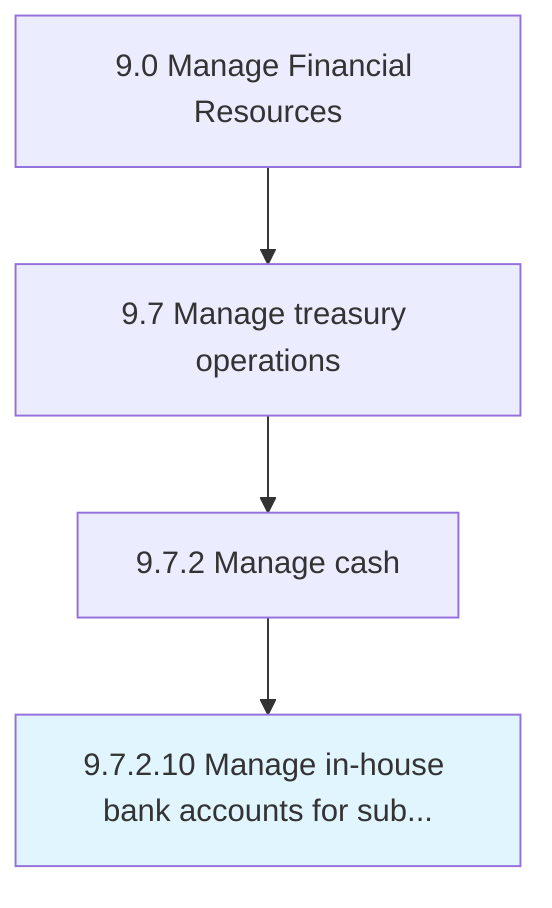

# Manage in-house bank accounts for subsidiaries

> Maintaining subsidiaries' company accounts opened with bank inside the corporation.

## Overview

Activity 9.7.2.10 is an activity within the Manage Financial Resources framework. 

Maintaining subsidiaries' company accounts opened with bank inside the corporation. Manage different financial services provided by in-house bank structure for parent companies' subsidiaries or branches.

## Process Hierarchy



## Key Statistics

| Metric | Value |
|--------|-------|
| APQC Code | 10901 |
| Hierarchy ID | 9.7.2.10 |
| Level | Activity |
| Parent | [9.7.2](../) |
| Sub-Processes | 0 |


## GraphDL Semantic Structure

```
manage.InhouseBankAccounts.for.Subsidiaries
```

| Component | Value | Description |
|-----------|-------|-------------|
| Verb | `manage` | Primary action |
| Object | `in-house bank accounts` | Direct object |
| Preposition | `for` | Relationship |
| PrepObject | `subsidiaries` | Indirect object |


---

*Source: APQC PCF 10901 (9.7.2.10) - APQC*
