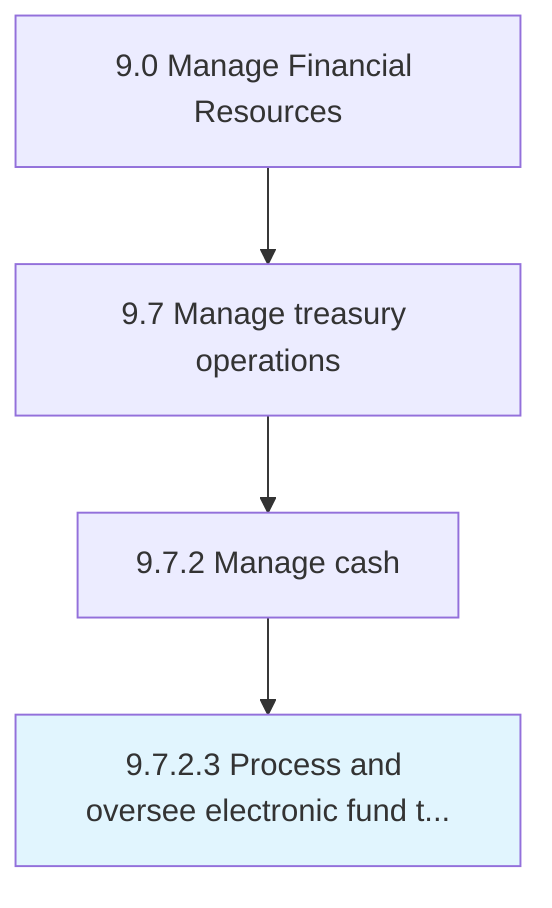

# Process and oversee electronic fund transfers (EFTs)

> Supervising all online transactions.

## Overview

Activity 9.7.2.3 is an activity within the Manage Financial Resources framework. 

## Process Hierarchy



## Key Statistics

| Metric | Value |
|--------|-------|
| APQC Code | 10895 |
| Hierarchy ID | 9.7.2.3 |
| Level | Activity |
| Parent | [9.7.2](../) |
| Sub-Processes | 0 |


## GraphDL Semantic Structure

```
process.AndOverseeElectronicFundTransfersEFTs
```

| Component | Value | Description |
|-----------|-------|-------------|
| Verb | `process` | Primary action |
| Object | `and oversee electronic fund transfers (EFTs)` | Direct object |


---

*Source: APQC PCF 10895 (9.7.2.3) - APQC*
