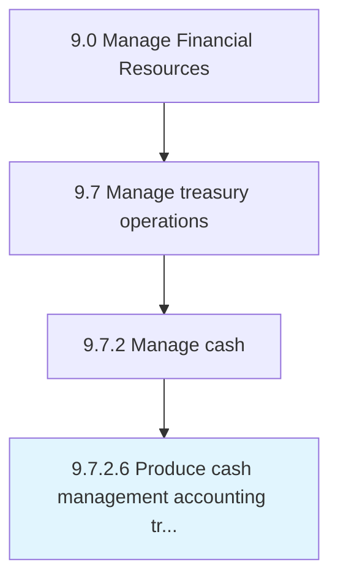

# Produce cash management accounting transactions and reports

> Presenting reports on all cash-related activities.

## Overview

Activity 9.7.2.6 is an activity within the Manage Financial Resources framework. 

Presenting reports on all cash-related activities. Collect and manage short-term investing activities. Prepare reports of all transactions done.

## Process Hierarchy



## Key Statistics

| Metric | Value |
|--------|-------|
| APQC Code | 10898 |
| Hierarchy ID | 9.7.2.6 |
| Level | Activity |
| Parent | [9.7.2](../) |
| Sub-Processes | 0 |


## GraphDL Semantic Structure

```
produce.CashManagementAccountingTransactionsAndReports
```

| Component | Value | Description |
|-----------|-------|-------------|
| Verb | `produce` | Primary action |
| Object | `cash management accounting transactions and reports` | Direct object |


## Related Concepts

- [CashManagementAccountingTransactions](/concepts/CashManagementAccountingTransactions)
- [Reports](/concepts/Reports)


---

*Source: APQC PCF 10898 (9.7.2.6) - APQC*
