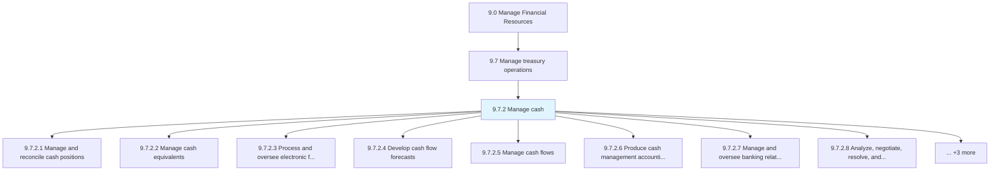
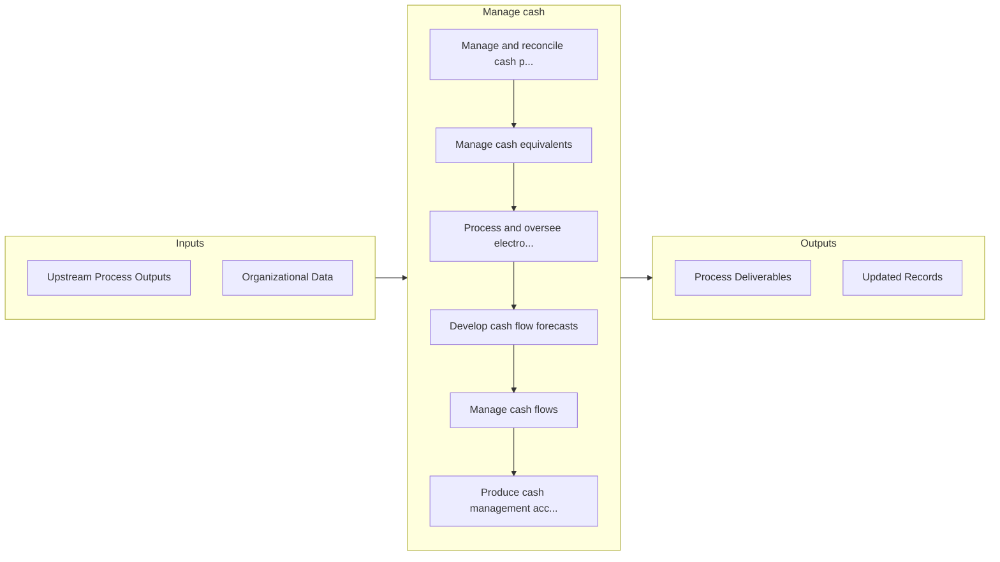

# Manage cash

> Taking care of all cash-related activities in the business.

## Overview

Process 9.7.2 is a core process that defines the specific procedures for manage cash. 

Taking care of all cash-related activities in the business. Manage and reconcile cash positions. Manage cash equivalents. Process and oversee electronic fund transfers. Develop cash flow forecasts. Manage cash flows. Produce cash management accounting transactions and reports. Manage and oversee banking relationships. Analyze, negotiate, resolve, and confirm bank fees.

## Process Hierarchy



## Key Statistics

| Metric | Value |
|--------|-------|
| APQC Code | 10759 |
| Hierarchy ID | 9.7.2 |
| Level | Process |
| Parent | [9.7](../) |
| Sub-Processes | 11 |


## GraphDL Semantic Structure

```graphdl
manage.Cash
```

| Component | Value | Description |
|-----------|-------|-------------|
| Verb | `manage` | Primary action |
| Object | `cash` | Direct object |


## Process Flow



## Sub-Processes

| Process | Hierarchy ID | Description |
|---------|-------------|-------------|
| [Manage and reconcile cash positions](./ManageAndReconcileCashPositions) | 9.7.2.1 | Correcting cash differences in the books of accounts |
| [Manage cash equivalents](./ManageCashEquivalents) | 9.7.2.2 | Taking care of all cash-related activities in the business |
| [Process and oversee electronic fund transfers (EFTs)](./ProcessAndOverseeElectronicFundTransfersEFTs) | 9.7.2.3 | Supervising all online transactions |
| [Develop cash flow forecasts](./DevelopCashFlowForecasts) | 9.7.2.4 | Preparing forecasts for the cash generated or used by the organization |
| [Manage cash flows](./ManageCashFlows) | 9.7.2.5 | Delaying the outflow of funds as long as possible, but encourage the inflow of as fast as possible |
| [Produce cash management accounting transactions and reports](./ProduceCashManagementAccountingTransactionsAndReports) | 9.7.2.6 | Presenting reports on all cash-related activities |
| [Manage and oversee banking relationships](./ManageAndOverseeBankingRelationships) | 9.7.2.7 | Maintaining and directing the course of relationships with banking partners |
| [Analyze, negotiate, resolve, and confirm bank fees](./AnalyzeNegotiateResolveAndConfirmBankFees) | 9.7.2.8 | Studying and finalizing bank fees for services provided by banks |
| [Manage in-house bank accounts](./ManageInhouseBankAccounts) | 9.7.2.9 | Managing financial services provided by an in-house bank structure in the corporation that is operat |
| [Manage in-house bank accounts for subsidiaries](./ManageInhouseBankAccountsForSubsidiaries) | 9.7.2.10 | Maintaining subsidiaries' company accounts opened with bank inside the corporation |
| [Manage and facilitate inter-company borrowing transactions](./ManageAndFacilitateIntercompanyBorrowingTransactions) | 9.7.2.11 | Arranging loans for subsidiaries from in-house banks |


## Related Concepts

- Cash


---

*Source: APQC PCF 10759 (9.7.2) - APQC*
