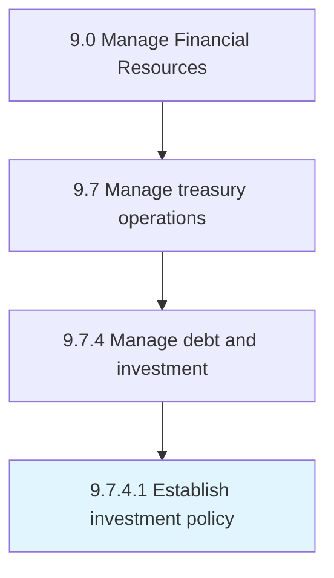

# Establish investment policy

> Developing and instituting principles that the organization ill use in making investments.

## Overview

Activity 9.7.4.1 is an activity within the Manage Financial Resources framework. 

Developing and instituting principles that the organization ill use in making investments.

## Process Hierarchy



## Key Statistics

| Metric | Value |
|--------|-------|
| APQC Code | 14079 |
| Hierarchy ID | 9.7.4.1 |
| Level | Activity |
| Parent | [9.7.4](../) |
| Sub-Processes | 0 |


## GraphDL Semantic Structure

```
establish.InvestmentPolicy
```

| Component | Value | Description |
|-----------|-------|-------------|
| Verb | `establish` | Primary action |
| Object | `investment policy` | Direct object |


## Related Concepts

- [InvestmentPolicy](/concepts/InvestmentPolicy)


---

*Source: APQC PCF 14079 (9.7.4.1) - APQC*
