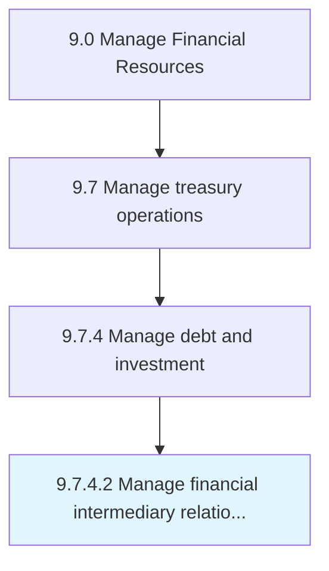

# Manage financial intermediary relationships

> Maintaining smooth relations with financial investment banks that help availing loans and services.

## Overview

Activity 9.7.4.2 is an activity within the Manage Financial Resources framework. 

Maintaining smooth relations with financial investment banks that help availing loans and services.

## Process Hierarchy



## Key Statistics

| Metric | Value |
|--------|-------|
| APQC Code | 10908 |
| Hierarchy ID | 9.7.4.2 |
| Level | Activity |
| Parent | [9.7.4](../) |
| Sub-Processes | 0 |


## GraphDL Semantic Structure

```
manage.FinancialIntermediaryRelationships
```

| Component | Value | Description |
|-----------|-------|-------------|
| Verb | `manage` | Primary action |
| Object | `financial intermediary relationships` | Direct object |


## Related Concepts

- FinancialIntermediaryRelationships


---

*Source: APQC PCF 10908 (9.7.4.2) - APQC*
