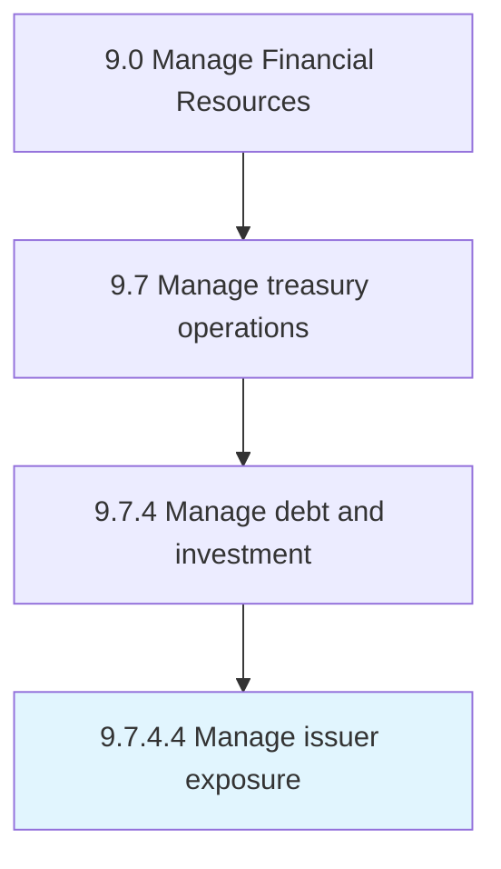

# Manage issuer exposure

> Managing the exposure incurred by the issuer for providing credit to the borrower.

## Overview

Activity 9.7.4.4 is an activity within the Manage Financial Resources framework. 

Managing the exposure incurred by the issuer for providing credit to the borrower.

## Process Hierarchy



## Key Statistics

| Metric | Value |
|--------|-------|
| APQC Code | 10910 |
| Hierarchy ID | 9.7.4.4 |
| Level | Activity |
| Parent | [9.7.4](../) |
| Sub-Processes | 0 |


## GraphDL Semantic Structure

```
manage.IssuerExposure
```

| Component | Value | Description |
|-----------|-------|-------------|
| Verb | `manage` | Primary action |
| Object | `issuer exposure` | Direct object |


## Related Concepts

- [IssuerExposure](/concepts/IssuerExposure)


---

*Source: APQC PCF 10910 (9.7.4.4) - APQC*
