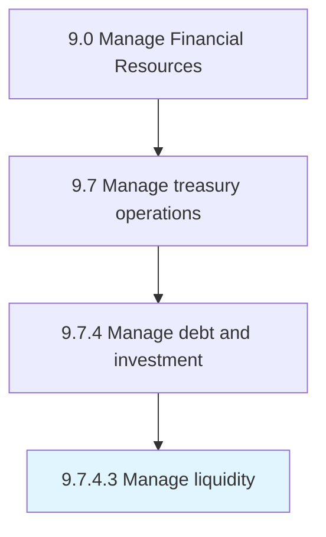

# Manage liquidity

> Managing and maintaining enough liquidity in form of cash and cash equivalents in the business to meet urgent and timely requirements.

## Overview

Activity 9.7.4.3 is an activity within the Manage Financial Resources framework. 

Managing and maintaining enough liquidity in form of cash and cash equivalents in the business to meet urgent and timely requirements

## Process Hierarchy



## Key Statistics

| Metric | Value |
|--------|-------|
| APQC Code | 10909 |
| Hierarchy ID | 9.7.4.3 |
| Level | Activity |
| Parent | [9.7.4](../) |
| Sub-Processes | 0 |


## GraphDL Semantic Structure

```
manage.Liquidity
```

| Component | Value | Description |
|-----------|-------|-------------|
| Verb | `manage` | Primary action |
| Object | `liquidity` | Direct object |


## Related Concepts

- Liquidity


---

*Source: APQC PCF 10909 (9.7.4.3) - APQC*
