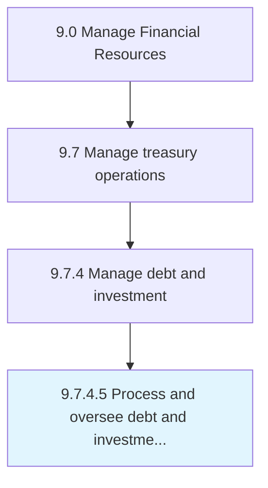

# Process and oversee debt and investment transactions

> Tracking loans taken and money invested in different options.

## Overview

Activity 9.7.4.5 is an activity within the Manage Financial Resources framework. 

Tracking loans taken and money invested in different options. Arrange and supervise loans from banks and individuals and investments in different available and profitable options.

## Process Hierarchy



## Key Statistics

| Metric | Value |
|--------|-------|
| APQC Code | 10911 |
| Hierarchy ID | 9.7.4.5 |
| Level | Activity |
| Parent | [9.7.4](../) |
| Sub-Processes | 0 |


## GraphDL Semantic Structure

```
process.AndOverseeDebtAndInvestmentTransactions
```

| Component | Value | Description |
|-----------|-------|-------------|
| Verb | `process` | Primary action |
| Object | `and oversee debt and investment transactions` | Direct object |


## Related Concepts

- [DebtTransactions](/concepts/DebtTransactions)
- [InvestmentTransactions](/concepts/InvestmentTransactions)
- [DebtTransactions](/concepts/DebtTransactions)
- [InvestmentTransactions](/concepts/InvestmentTransactions)


---

*Source: APQC PCF 10911 (9.7.4.5) - APQC*
