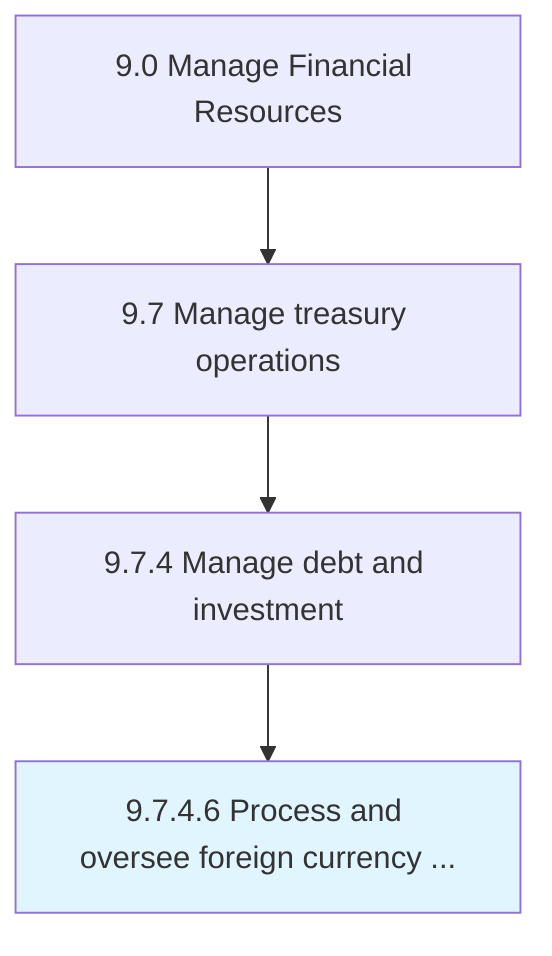

# Process and oversee foreign currency transactions

> Arranging and supervising foreign exchange rate changes to avoid loss on foreign-currency transactions.

## Overview

Activity 9.7.4.6 is an activity within the Manage Financial Resources framework. 

Arranging and supervising foreign exchange rate changes to avoid loss on foreign-currency transactions.

## Process Hierarchy



## Key Statistics

| Metric | Value |
|--------|-------|
| APQC Code | 10912 |
| Hierarchy ID | 9.7.4.6 |
| Level | Activity |
| Parent | [9.7.4](../) |
| Sub-Processes | 0 |


## GraphDL Semantic Structure

```
process.AndOverseeForeignCurrencyTransactions
```

| Component | Value | Description |
|-----------|-------|-------------|
| Verb | `process` | Primary action |
| Object | `and oversee foreign currency transactions` | Direct object |


## Related Concepts

- ForeignCurrencyTransactions
- ForeignCurrencyTransactions


---

*Source: APQC PCF 10912 (9.7.4.6) - APQC*
