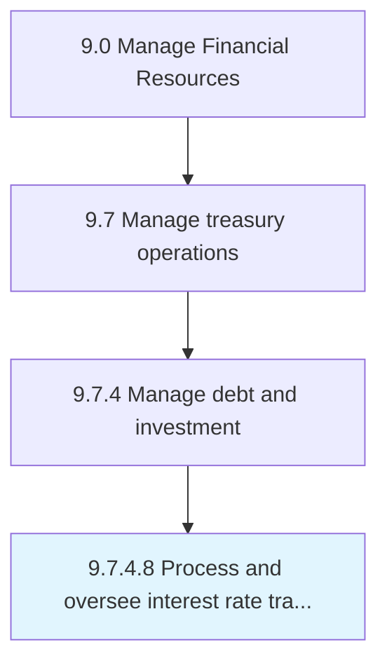

# Process and oversee interest rate transactions

> Supervising the interest paid or received by the organization.

## Overview

Activity 9.7.4.8 is an activity within the Manage Financial Resources framework. 

Supervising the interest paid or received by the organization. Arrange and supervise interest rate swap transactions to manage exposure to fluctuations in interest rates. Or attain a marginally lower rate of interest than could be gained through a swap.

## Process Hierarchy



## Key Statistics

| Metric | Value |
|--------|-------|
| APQC Code | 14210 |
| Hierarchy ID | 9.7.4.8 |
| Level | Activity |
| Parent | [9.7.4](../) |
| Sub-Processes | 0 |


## GraphDL Semantic Structure

```
process.AndOverseeInterestRateTransactions
```

| Component | Value | Description |
|-----------|-------|-------------|
| Verb | `process` | Primary action |
| Object | `and oversee interest rate transactions` | Direct object |


## Related Concepts

- InterestRateTransactions
- InterestRateTransactions


---

*Source: APQC PCF 14210 (9.7.4.8) - APQC*
