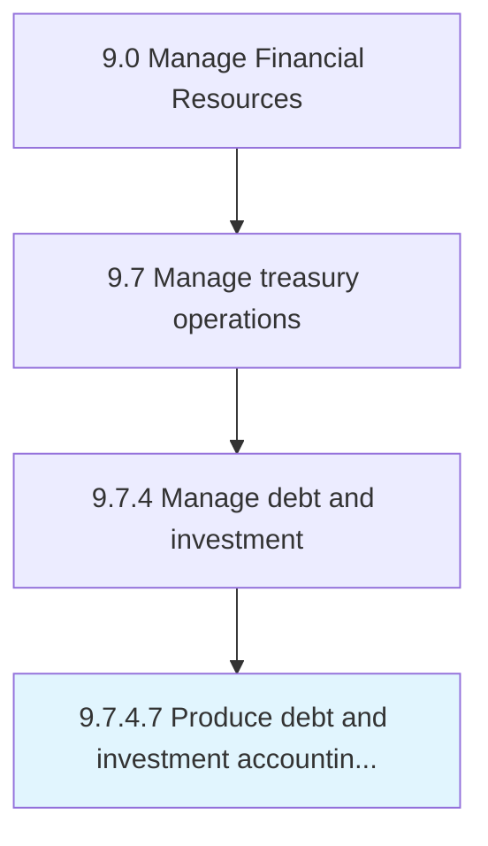

# Produce debt and investment accounting transaction reports

> Creating transactions report of loans and investments.

## Overview

Activity 9.7.4.7 is an activity within the Manage Financial Resources framework. 

Creating transactions report of loans and investments. Prepare and maintain records of loans and investment transactions.

## Process Hierarchy



## Key Statistics

| Metric | Value |
|--------|-------|
| APQC Code | 10913 |
| Hierarchy ID | 9.7.4.7 |
| Level | Activity |
| Parent | [9.7.4](../) |
| Sub-Processes | 0 |


## GraphDL Semantic Structure

```
produce.DebtAndInvestmentAccountingTransactionReports
```

| Component | Value | Description |
|-----------|-------|-------------|
| Verb | `produce` | Primary action |
| Object | `debt and investment accounting transaction reports` | Direct object |


## Related Concepts

- [DebtAccountingTransactionReports](/concepts/DebtAccountingTransactionReports)
- [InvestmentAccountingTransactionReports](/concepts/InvestmentAccountingTransactionReports)


---

*Source: APQC PCF 10913 (9.7.4.7) - APQC*
