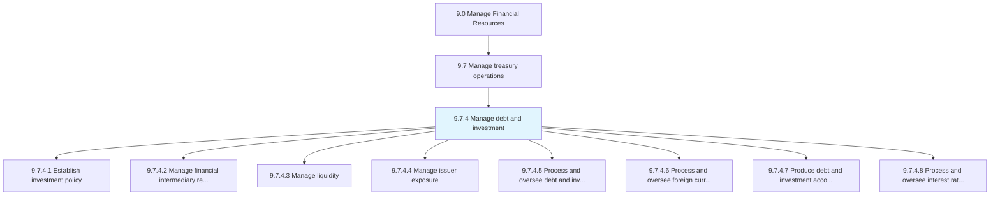
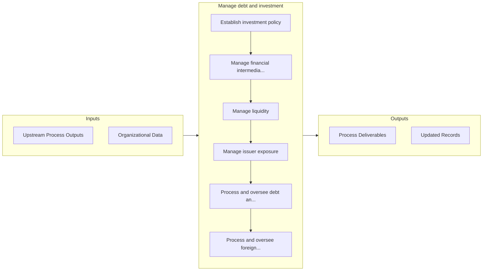

# Manage debt and investment

> Taking care of the organization's financial position.

## Overview

Process 9.7.4 is a core process that defines the specific procedures for manage debt and investment. 

Taking care of the organization's financial position. Manage its loans or debts from different sources and investments. Leverage the most profitable options to balance the financial position in the market.

## Process Hierarchy



## Key Statistics

| Metric | Value |
|--------|-------|
| APQC Code | 10761 |
| Hierarchy ID | 9.7.4 |
| Level | Process |
| Parent | [9.7](../) |
| Sub-Processes | 8 |


## GraphDL Semantic Structure

```
manage.DebtAndInvestment
```

| Component | Value | Description |
|-----------|-------|-------------|
| Verb | `manage` | Primary action |
| Object | `debt and investment` | Direct object |


## Process Flow



## Sub-Processes

| Process | Hierarchy ID | Description |
|---------|-------------|-------------|
| [Establish investment policy](./EstablishInvestmentPolicy) | 9.7.4.1 | Developing and instituting principles that the organization ill use in making investments |
| [Manage financial intermediary relationships](./ManageFinancialIntermediaryRelationships) | 9.7.4.2 | Maintaining smooth relations with financial investment banks that help availing loans and services |
| [Manage liquidity](./ManageLiquidity) | 9.7.4.3 | Managing and maintaining enough liquidity in form of cash and cash equivalents in the business to me |
| [Manage issuer exposure](./ManageIssuerExposure) | 9.7.4.4 | Managing the exposure incurred by the issuer for providing credit to the borrower |
| [Process and oversee debt and investment transactions](./ProcessAndOverseeDebtAndInvestmentTransactions) | 9.7.4.5 | Tracking loans taken and money invested in different options |
| [Process and oversee foreign currency transactions](./ProcessAndOverseeForeignCurrencyTransactions) | 9.7.4.6 | Arranging and supervising foreign exchange rate changes to avoid loss on foreign-currency transactio |
| [Produce debt and investment accounting transaction reports](./ProduceDebtAndInvestmentAccountingTransactionReports) | 9.7.4.7 | Creating transactions report of loans and investments |
| [Process and oversee interest rate transactions](./ProcessAndOverseeInterestRateTransactions) | 9.7.4.8 | Supervising the interest paid or received by the organization |


## Related Concepts

- Debt
- Investment


---

*Source: APQC PCF 10761 (9.7.4) - APQC*
