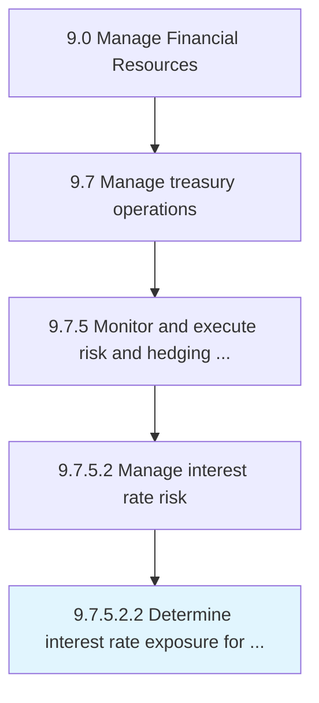

# Determine interest rate exposure for all markets

> Identifying potential interest rate risks for all markets.

## Overview

Sub-Activity 9.7.5.2.2 is an activity within the Manage Financial Resources framework. 

Identifying potential interest rate risks for all markets.

## Process Hierarchy



## Key Statistics

| Metric | Value |
|--------|-------|
| APQC Code | 19576 |
| Hierarchy ID | 9.7.5.2.2 |
| Level | Sub-Activity |
| Parent | [9.7.5.2](../) |
| Sub-Processes | 0 |


## GraphDL Semantic Structure

```
determine.InterestRateExposure.for.AllMarkets
```

| Component | Value | Description |
|-----------|-------|-------------|
| Verb | `determine` | Primary action |
| Object | `interest rate exposure` | Direct object |
| Preposition | `for` | Relationship |
| PrepObject | `all markets` | Indirect object |


## Related Concepts

- InterestRateExposure
- Markets


---

*Source: APQC PCF 19576 (9.7.5.2.2) - APQC*
